This blog post is the following on my previous post about [VR in Unity](). It is meant as a small unity Tutorial to get the ball rolling with Unity (no pun intended). Hopefully next week will be about actual VR stuff.

## Creating a new project

To create and setup a new unity project, please refer to [the previous tutorial]().

## Create a new scene

Once you have opened your project, we will create a new scene. To do that, go to file -> new scene.


A context window will open, choose the Basic (Built-in) template, and click on create.

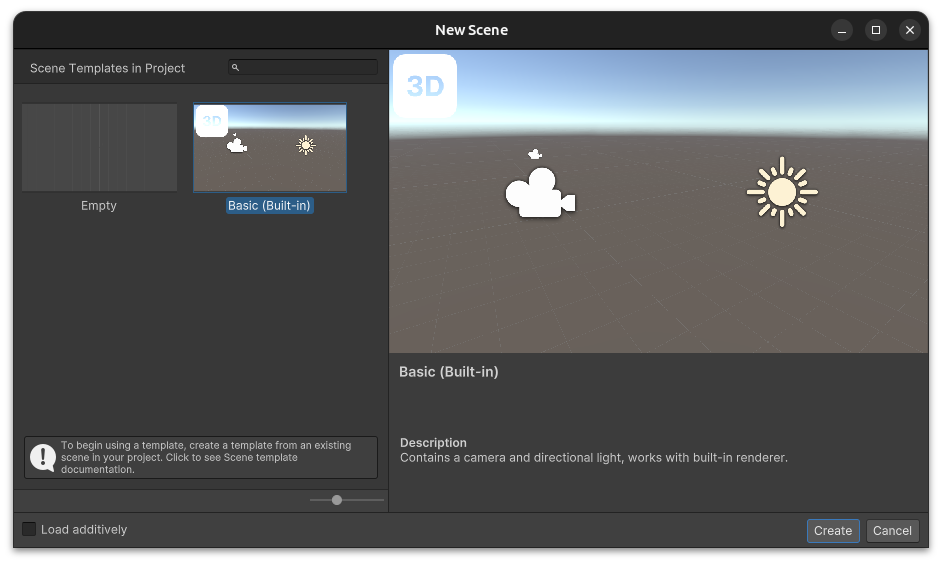

You will be placed inside the untitled scene. To save it, go to `File` -> `Save As`. Choose a name (like `RollABall`) and save it in the scene folder of your project.


## Create the ground

The first thing we want to do now is to create our game environment. Starting with the ground of course. 

For this project, the ground will be a simple flat plane. Go to `GameObject` -> `3D Object` -> `Plane`.

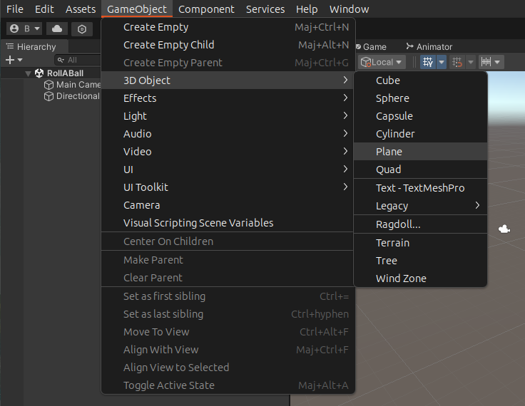

To focus the camera on the plane, simply click on it with your mouse and press `F`. You should see something like this:

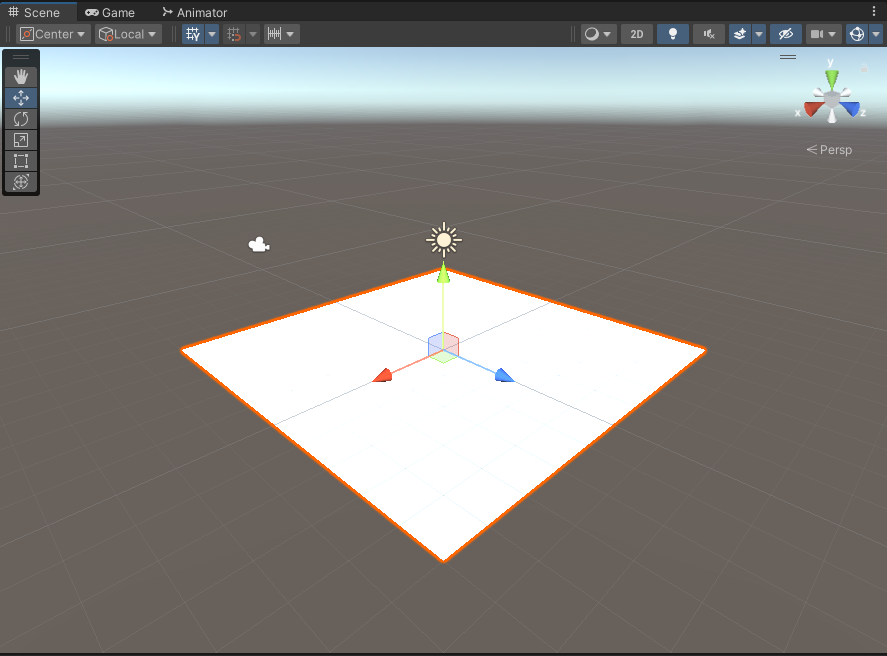

To make it bigger, we can go to the inspector and set the scale to `2` on the `X` and `Z` axis.


If you do not see this in your inspector, make sure the ground plane is selected. You can press `F` again to see the whole plane.

## Create the ball

Now it is time to create the ball that will be our player. To do that, go to `GameObject` -> `3D Object` -> `Sphere`, just like we did for the plane.

In the inspector, set the Y position to `0.5` so that the ball is not inside the ground. Press `F` to focus on the ball. You should see something like this:


## Lighting

Do not like the look of it? Lighting is everything. We can change the lighting color to our liking.

In the object hierarchy on the left, select the `Directional Light` object.

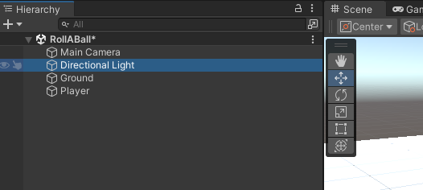

Now on your right (you will get used to the eyes exercise), in the inspector, you can change the color of the light. I chose a nice blue.

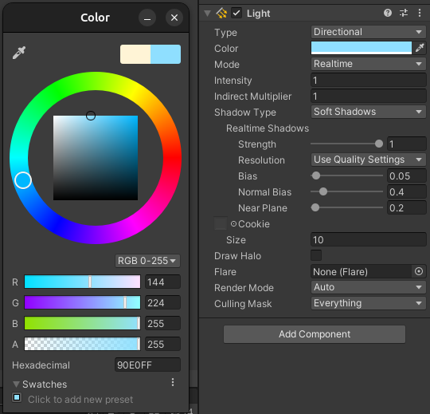

We can also change the direction the light is coming from. In the `Transform` component of the light, try changing the rotations for `X` and `Y`. `Z` does not change anything so you can leave it at `0`.

## Saving your project

Don't forget to save regularly! Nobody likes loosing hours of work because of a crash. To save, go to `File` -> `Save`.

## Materials

Our scene still looks bland. To make it look better, we will add some materials. Materials define the look of individual objects.

In your `Assets` folder that you can find at the bottom of the screen, right click and choose `Create` -> `Folder`. Name it `Materials`.


Now we will create a new material inside the folder. Right click on the folder and choose `Create` -> `Material`. Name it `Background`.

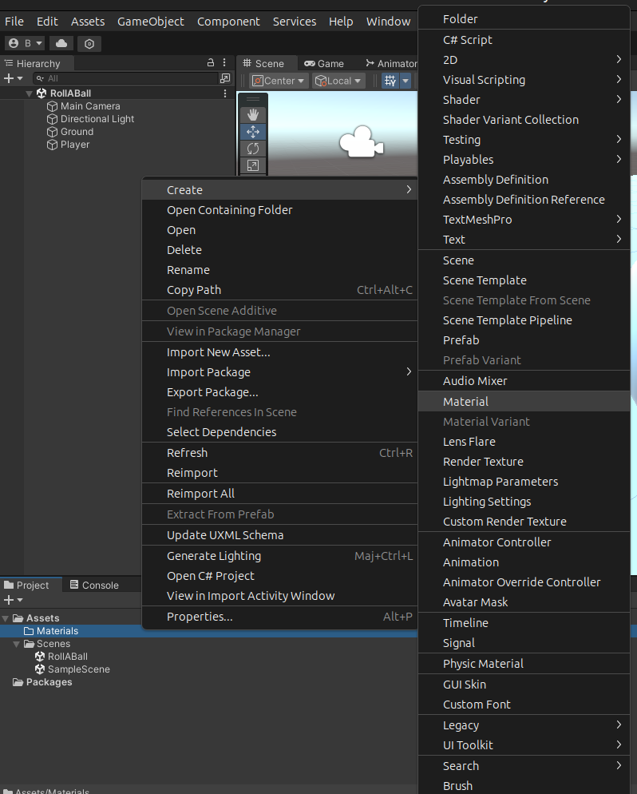

To apply in on the ground, simply drag and drop it from the bottom of your screen onto the ground in the scene view.

At this point nothing has changed and you may be wondering why am I loosing your time like this.

The reason is that we still have to change its properties in the inspector. Select your material, choose a dark gray color, and set the smoothness to `0.25` to make it look like a plastic.

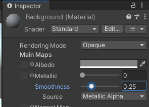

Now you can do the same the player sphere, but this time choose a color of your choice. I chose a nice red.

Your scene should look like this:


## Controlling the player

Now we get to the more exciting stuff: Interaction and moving our player around!

### Add a rigidbody

We want our ball to be rolling, so we will need the physics engine of Unity. To do that, we will add a `Rigidbody` component to our ball.

Select the player sphere, and in the inspector, click on `Add Component`. Search for `Rigidbody` and click on it.

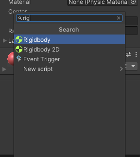

### The input system

Now we will need to read the input from the keyboard. I can't believe that I am writing this but as of 2023, Unity's input system is not directly in the editor, we have to install it.

Let's go to `Window` -> `Package Manager`.

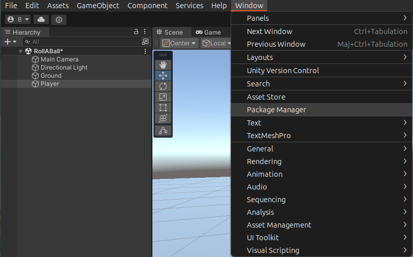

Then we need to show the packages from the `Unity Registry`. Click on `packages:` and choose `Unity Registry`.


Now we search for the `Input System` using the search bar. Click on `Install`, during the installation you might get prompts, just press `yes` and proceed.

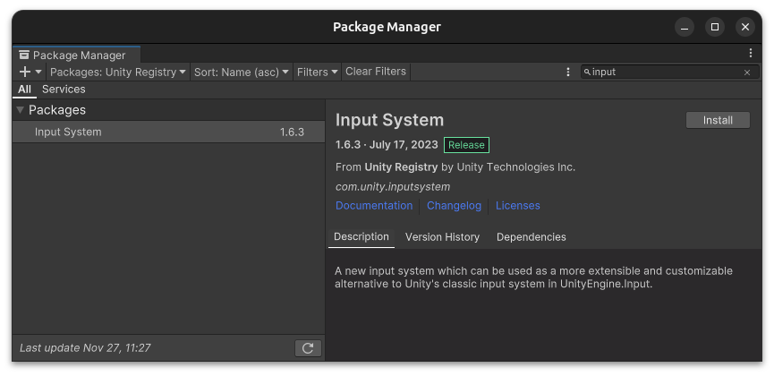

Now let's select our player sphere again, and add a `Player Input` component to it, just like we did for the `Rigidbody`. This will allow us to read the input from the keyboard.

The updated inspector will show this:

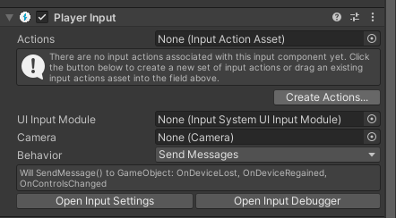

Let's click on `Create Actions` to create the actions we will need to move our player.

You will be prompted to save the actions in a folder. Create a new folder called `Input` in your `Assets` folder and save the actions there as `InputActions`.

We end up with this strange window:


We close it for now, but we will be back!

### Scripting with C#

In Unity, scripts are used to create behaviors for objects. They are written using the C# programming language that is basically Java (another language with much more adoption), but by Microsoft. 

We will create a script to move our player around. First let's create a `Scripts` folder in our `Assets` folder, like we did for the `Input`, `Materials` and `Scenes` folders.

Now let's right click on the `Scripts` folder and choose `Create` -> `C# Script`. Name it `PlayerController`.

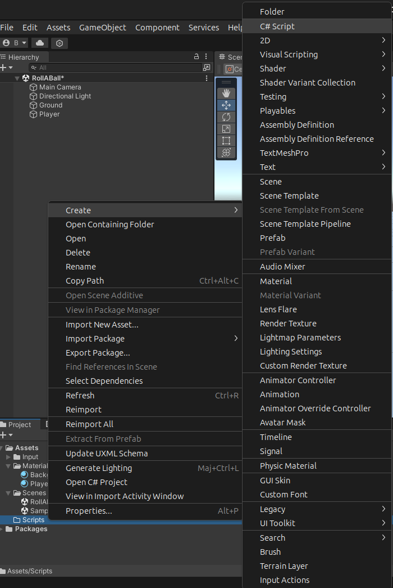

We can then drag and drop the script onto our player sphere in the scene view just like with the materials.

Now if we double click on the script, it will open in your default code editor. I use Visual Studio Code, but you can use whatever you want. We see the following code:

```csharp
using System.Collections;
using System.Collections.Generic;
using UnityEngine;

public class PlayerController : MonoBehaviour
{
    // Start is called before the first frame update
    void Start()
    {
        
    }

    // Update is called once per frame
    void Update()
    {
        
    }
}
```

This is the base for all behavior scripts in Unity. The Start function is called when the object is created, and the Update function is called every frame. As we are using Unity's input system, we won't actually need the Update function, you can remove it if you want.

First things first, let's tell Unity that we will use the Input system. With the other `using` statements, add the following:

```csharp
using UnityEngine.InputSystem;
```

To read the movement from the keyboard, we also need to add an `OnMove` function along side the `Start` function. It will be called every time the player moves.

```csharp
using System.Collections;
using System.Collections.Generic;
using UnityEngine;
using UnityEngine.InputSystem;

public class PlayerController : MonoBehaviour
{
    // Start is called before the first frame update
    void Start()
    {
        
    }

    void OnMove (InputValue movementValue)
    {
   
    }

    // Update is called once per frame
    void Update()
    {
        
    }
}
```