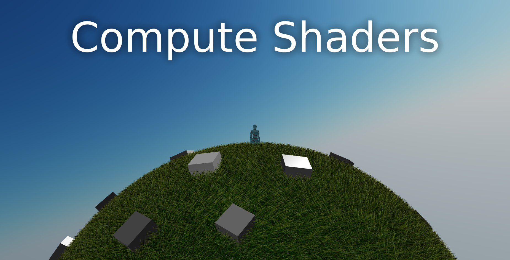
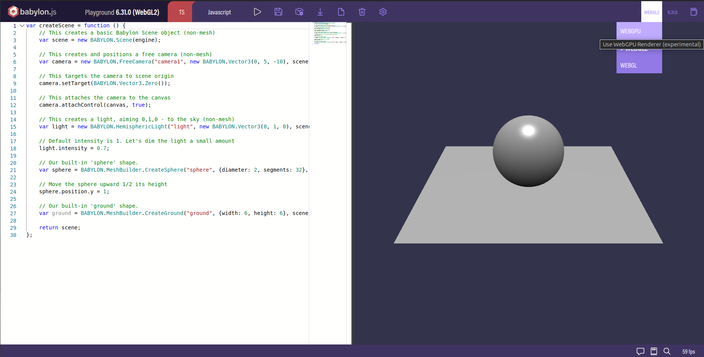
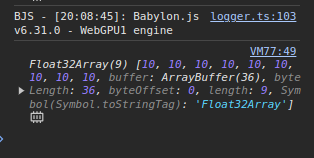

Welcome to my tutorial on compute shaders using WebGPU and BabylonJS! It is meant to be accessible to beginers and then to provide concrete use cases of compute shaders in the context of terrain generation and grass rendering.

## What is a compute shader?

Let's say you have an array of numbers like this:

```js
let numbers = [1, 2, 3, 4, 5, 6, 7, 8, 9, 10];
```

Now if you want to add 1 to each number, you can do it like this:

```js
for (let i = 0; i < numbers.length; i++) {
  numbers[i] += 1;
}
```

What happpens here is that the CPU (central processing unit) will take each number one by one and add 1 to it. This is called sequential processing. The CPU can only do one thing at a time (I am actually lying here, but let's keep it simple for now).

If we have 10 numbers, sequential processing will be fine, but what if the array has 1 million numbers? That would take a long time!

Nowadays, cpus have multiple cores, like 8 or 16, but even then doing the array processing 8 times faster is not enough, we want to do it 1000 times faster or more!

CPUs are not designed for parallel processing, but you know what is very good at it? GPUs! (graphics processing units). 

GPUs don't have 8 cores, they have thousands of cores! Leveraging all these cores is what makes GPU computing so powerful.

They were originally designed to process pixels of the screen in parallel, but they grew in versatility and now they can do a lot of things, not just pixel processing.

So you have it, a compute shader is a program that runs on the GPU and can do parallel processing of arbitrary data.

## What is WebGPU?

As I mentionned at the beginning, we will be using WebGPU to write our compute shaders. WebGPU is a new graphics API that is currently being developed by the W3C. Its main strength is that it aims to be cross-platform, targeting native applications and also the web!

We will develop right in the browser, using BabylonJS, a 3D engine that supports WebGPU. By doing that, we don't need to install any code editor or compiler.

### Requirements

The support of WebGPU on different platforms is kept updated at https://github.com/gpuweb/gpuweb/wiki/Implementation-Status

The requirements will evolve in the future as WebGPU adoption grows. For the time being, here are the requirements:

#### Windows, Mac, ChromeOS

If you are on Windows, you need a chromium browser with a version >= 113. Chromium browsers include Brave, Chromium, Vivaldi, Opera and Chrome of course. Unfortunately, as I am writing these lines, Firefox support for WebGPU is lacking.

#### Linux

If you use Linux (and you are damn right to do so), you need to install google-chrome-unstable for your distibution. To enable WebGPU, you must then launch it using this command line:

```sh
google-chrome-unstable --enable-unsafe-webgpu --enable-features=Vulkan,UseSkiaRenderer
```

## Your first compute shader

Let's dive into the meat of this tutorial. We will write a simple compute shader that will add 2 arrays together and store the result in a third array.

We won't need any code editor, only a browser.

Let's head to the [BabylonJS playground](https://playground.babylonjs.com/), which is a great tool to prototype with WebGPU directly in the browser.

We are greeted by see something like this:



On the left is the code editor and on the right the 3D scene. As we are only doing array processing, we don't really care about the 3D stuff.

First thing first on the top right of the playground, make sure that the rendering engine is set to WebGPU and not WebGL or WebGL2. Otherwise, you won't be able to run compute shaders.

Once that's done we are ready to code!

## Writing in WGSL

First we can get rid of all the code that is not related to the scene and the camera (BabylonJS needs at least a camera to work even when we are not using it).

We are left with:

```js
var createScene = function () {
    var scene = new BABYLON.Scene(engine);
    var camera = new BABYLON.FreeCamera("camera1", new BABYLON.Vector3(0, 5, -10), scene);

    // We will write all of our code here

    return scene;
};
```

let's declare a variable that will store our shader code:
    
```js
const shaderCode = `
// We will write our shader code here
`;
```

Notice that we are using backticks instead of regular quotes. This is because we will be writing our shader code on multiple lines and backticks allow us to do that.

Don't forget to save your playground, otherwise you may lose your code! To save your code, click on the floppy disk icon on the top bar of the playground.

### Input and output

Now we will specify what goes in and what goes out of our compute shader. We will get 2 arrays as input and one array as output (the sum of the 2 inputs).

WebGPU shaders are written in the new WGSL language (WebGPU Shader Language). Its syntax is very strict as we must specify an id for every input and output:

```wgsl
@group(0) @binding(0) var<storage,read_write> firstArray: array<f32>;
@group(0) @binding(1) var<storage,read_write> secondArray: array<f32>;
@group(0) @binding(2) var<storage,read_write> resultArray: array<f32>;
```

These ids will be super important when we will be binding our data to the shader.

Groups are used to group variables that are related to each other. In our case, all the arrays are related to each other, so we put them in the same group. Generally, we don't need to use more than one group if we are not doing some crazy optimization.

### The main function

Now that we declared our inputs and outputs, we must declare the main function of our shader. This function will be the entry point of our shader. Each thread will execute this function with a unique id.

```wgsl
@compute @workgroup_size(1, 1, 1)
fn main(@builtin(global_invocation_id) global_id: vec3<u32>) {
    
}
```

There is a lot to unpack here, but we will do that step by step to make it digestible.

The `@compute` part is a decorator that tells the compiler that this function is a compute shader (it might be something else like a pixel shader). 

The `@workgroup_size(1, 1, 1)` part tells the compiler that we will be using 1 thread per workgroup.

Basically if you want to perform 1000 operations in parallel, you could dispatch one group of 1000 threads, or 10 groups of 100 threads, or 100 groups of 10 threads, etc. The number of threads per group is up to you, it really depends on the problem you are trying to solve.

Here we are only using the simplest configuration, one thread per group.

Then, we declare the main function using `fn main(@builtin(global_invocation_id) global_id: vec3<u32>)`. 

The `@builtin(global_invocation_id)` part is a decorator that tells the compiler that the `global_id` variable is a special variable that will be provided by the runtime. 

The `global_id` variable is a vector of 3 integers. It is unique for the current thread. 

As each thread will be responsible for adding two numbers, we will use the `x` component of the `global_id` variable as the index of the number we want to add.

### Adding the arrays

In the main function we declare the index that the thread will be responsible for:

```wgsl
let index: u32 = global_id.x;
```

Then we can simply perform the addition:

```wgsl
resultArray[index] = firstArray[index] + secondArray[index];
```

At the end, our shader looks like this:

```wgsl
@group(0) @binding(0) var<storage,read_write> firstArray: array<f32>;
@group(0) @binding(1) var<storage,read_write> secondArray: array<f32>;
@group(0) @binding(2) var<storage,read_write> resultArray: array<f32>;

@compute @workgroup_size(1, 1, 1)
fn main(@builtin(global_invocation_id) global_id: vec3<u32>) {
    let index: u32 = global_id.x;
    resultArray[index] = firstArray[index] + secondArray[index];
}
```

You can compare your code with [my own playground](https://playground.babylonjs.com/#JF2J4P) to see if you did it right.

## The CPU side of thing

Now the only thing left to do is to send our arrays from the cpu to the shader on the gpu and then retrieve the result back to the cpu.

### Create a ComputeShader object

In BabylonJS, we can declare a compute shader object that will handle the binding for us:

```js
const computeShader = new BABYLON.ComputeShader(
    "MyAwesomeComputeShader", // give it a name
    engine, // give it the WebGPU engine
    { computeSource: shaderCode }, // give it our shader code
    // Then declare the same bindings as what was in our code
    {
        bindingsMapping: {
            firstArray: { group: 0, binding: 0 },
            secondArray: { group: 0, binding: 1 },
            resultArray: { group: 0, binding: 2 }
        }
    }
);
```

You may ask where does the `engine` variable come from as it is not declared in the playground. It is actually a global variable that is declared outside of the editable code. It is a BabylonJS object that handles the rendering and the communication with the GPU.

### Declare the Arrays

And now we declare the arrays we want to add together. Make sure they have the same length, otherwise we might get some undefined behavior.

```js
const firstArray = new Float32Array([1, 2, 3, 4, 5, 6, 7, 8, 9]);
const secondArray = new Float32Array([9, 8, 7, 6, 5, 4, 3, 2, 1]);
```

You can change the values to your liking of course, as long as the arrays have the same length.

### Send the arrays to the GPU

We then send the data to the GPU using Babylon's storage buffers:

```js
const bufferFirstArray = new BABYLON.StorageBuffer(engine, firstArray.byteLength);
bufferFirstArray.update(firstArray);

const bufferSecondArray = new BABYLON.StorageBuffer(engine, secondArray.byteLength);
bufferSecondArray.update(secondArray);

// The result array does not need to be updated with a set of values as it will hold the result of the computation
const bufferResultArray = new BABYLON.StorageBuffer(engine, Float32Array.BYTES_PER_ELEMENT * firstArray.length);
```

### Bind the GPU buffers to the shader

Our data may be on the GPU, but we still have to tell the compute shader to use them. To do that we use the `setStorageBuffer` method:

```js
// The names are important, make sure they match the names in the shader and in the bindings
computeShader.setStorageBuffer("firstArray", bufferFirstArray);
computeShader.setStorageBuffer("secondArray", bufferSecondArray);
computeShader.setStorageBuffer("resultArray", bufferResultArray);
```

## Let's run it!

If you followed until here, congratulations! You are now ready to run your first compute shader!

As the compute shader runs on the GPU, recovering the result is an asynchronous operation. We must wait for the GPU to finish its work before we can read the result.

```js
computeShader.dispatchWhenReady(firstArray.length, 1, 1).then(() => {
    bufferResultArray.read().then((res) => {
        const result = new Float32Array(res.buffer);
        console.log(result);
    });
});
```

The `console.log` will print the result of the addition of the 2 arrays in the browser console. To open the console, press `F12` and go to the `Console` tab in the developer tools.

Now let's press the run button (The triangle next to the floppy disk icon) and see what happens!



It worked! We indeed got the addition of the 2 arrays from the GPU. You can try changing the values of the arrays and see that the result changes accordingly.

You can find the complete code for the tutorial [here](https://playground.babylonjs.com/#JF2J4P#2)

In the next tutorial, we will learn how to send more complex data to the GPU and how to use it in our shader. After that, we will see how to use compute shaders to generate terrain and render grass.