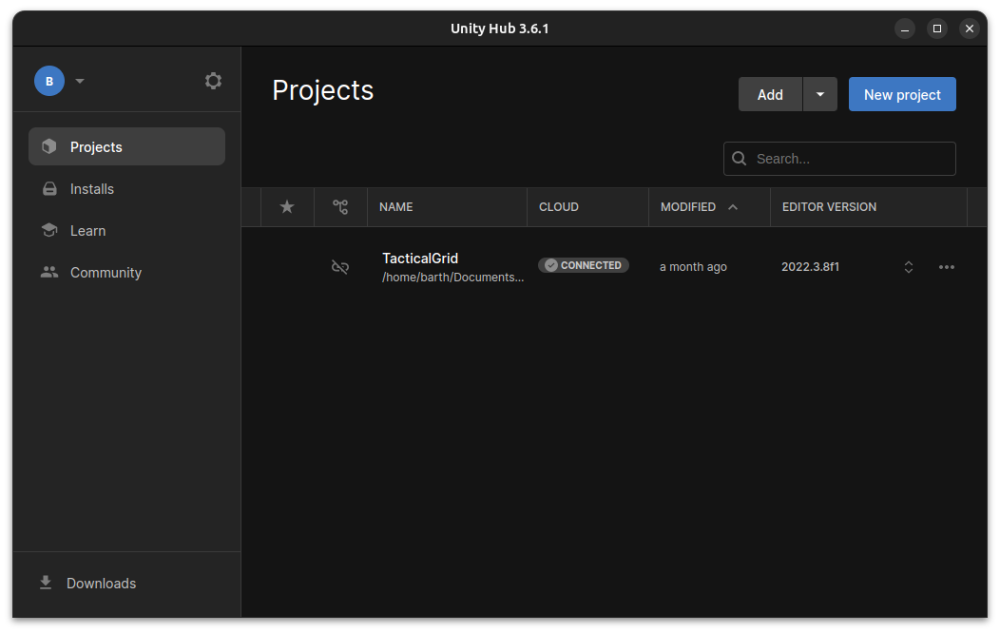
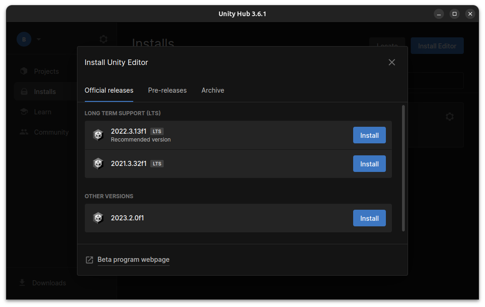
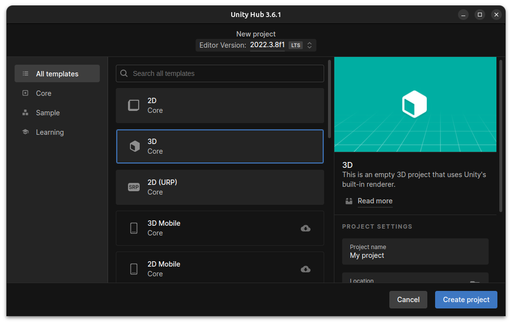
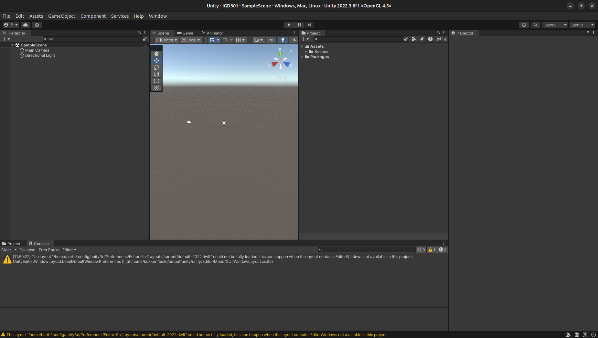

Hello, welcome to my blog! This is the first post of a series of posts about VR development with Unity. I am currently a student at Telecom Paris and writing this blog is part of our assignment. I will try to keep things as simple as possible so that everyone can follow along.

For this first part, I will only cover the setup part of our development environment with Unity. If you already have Unity installed and know how to use it, you can skip this part.

## What is VR?

VR stands for Virtual Reality. It is a technology that allows you to immerse yourself in a virtual world. It is usually achieved by wearing a headset that will display avirtual world before your eyes and track your head movements so that you can look around in the virtual world and interact with it.

## What is Unity?

Unity is a game engine. It is a software that allows you to create games and applications, you can see it as our toolbox for this series. It has a huge community and is relatively easy to use. For alternatives, check out Godot or Unreal Engine.

## Setup Unity

### Install Unity Hub

To install unity on your machine, you will need Unity Hub. First download it at https://unity.com/download

Additional informations for troubleshooting are available at https://docs.unity3d.com/2021.1/Documentation/Manual/GettingStartedInstallingHub.html if needed.

### Install Unity Editor

Now you can launch unity hub and you should see something like this:

Note that the color may change depending on your system theme and of course if you just installed the hub, there will be no projects in the project section.

Now on your left there are 4 tabs: `Projects`, `Installs`, `Learn` and `Community`. then click on the top right button `Installs` and you should see something like this:

I will be using Unity Editor version 2022.3.8f1 for this series but it should also work for versions not far from that one. Unity unfortunately is notorious for breaking backward compatibility, so that might prove important.

Click on install on the version that you want.

You will be prompted to add modules to customize your install, we will need the `Android Build Support` module so make sure to check it.

You can always add modules later by clicking on the wheel icon on your installed version in the `Installs` tab.

### Create a new project

Now go back to the `Projects` tab and click on `New Project` and you should see something like this:

We will choose the `3D` template for this series, choose a name you like and then click on `Create Project`.

If everything went well, Unity will open your project and you should see something like this:

