This blog post is the 2nd in the VR with Unity series.

This week, we are setting a small scene in Unity to get familiar with the editor and have something to work with in VR next week. This is essentially the [Roll a Ball tutorial](https://learn.unity.com/project/roll-a-ball) from Unity, but with a few changes.

If you already know how to use Unity, you can go crazy and expend on `Roll a Ball` as long as the core mechanic is the same (we will need it next week).

## Creating a new project

We saw last week how to create and setup a new unity project. If you don't know how to proceed, please refer to the [first part of the series](https://barthpaleologue.github.io/Blog/posts/vr-with-unity-1/).

## Create a new scene

We will now create a new scene that will hold today's session. To do that, go to file -> new scene.

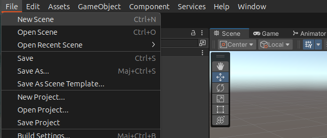

A context window will open, choose the Basic (Built-in) template, and click on create.


We are now inside the untitled scene. To save it, go to `File` -> `Save As`. Choose a name (like `RollABall`) and save it in the scene folder of your project.

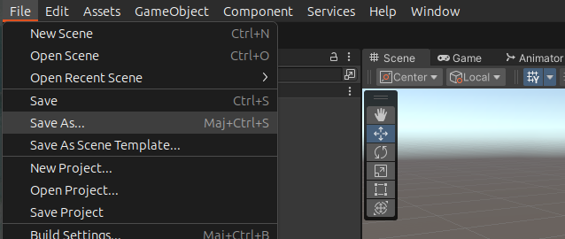

## Create the ground

The first thing we want to do now is to create our game environment. Starting with the ground of course. 

For this project, the ground will be a simple flat plane. Go to `GameObject` -> `3D Object` -> `Plane`.


To focus the camera on the plane, simply click on it with the mouse and press `F`. You should see something like this:


To make it bigger, we can go to the inspector and set the scale to `2` on the `X` and `Z` axis.

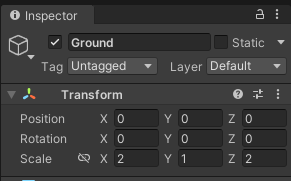

If you do not see this in your inspector, make sure the ground plane is selected. You can press `F` again to see the whole plane.

## Create the ball

Now it is time to create the ball that will be our player. To do that, go to `GameObject` -> `3D Object` -> `Sphere`, just like we did for the plane.

In the inspector, set the Y position to `0.5` so that the ball is not inside the ground. Press `F` to focus on the ball. You should see something like this:

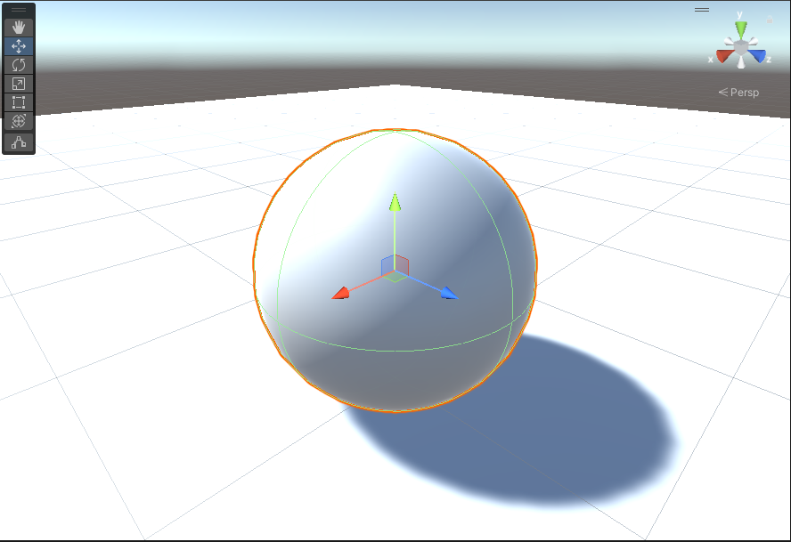

## Lighting

Do not like the look of it? Lighting is everything. We can change the lighting color to our liking.

In the object hierarchy on the left, select the `Directional Light` object.


Now on your right (you will get used to the eyes exercise), in the inspector, you can change the color of the light. I chose a nice blue.


We can also change the direction the light is coming from. In the `Transform` component of the light, try changing the rotations for `X` and `Y`. `Z` does not change anything so you can leave it at `0`.

## Saving your project

Don't forget to save regularly! Nobody likes loosing hours of work because of a crash. To save, go to `File` -> `Save`. You can also press `Ctrl + S` to save.

## Materials

Our scene still looks bland. To make it look better, we will add some materials. Materials define the look of individual objects.

In the `Assets` folder that you can find at the bottom of the screen, right click and choose `Create` -> `Folder`. Name it `Materials`.

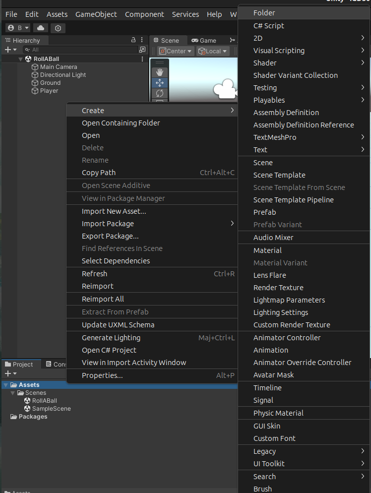

Now we will create a new material inside the folder. Right click on the folder and choose `Create` -> `Material`. Name it `Background`.


To apply in on the ground, simply drag and drop it from the bottom of your screen onto the ground in the scene view.

At this point nothing has changed and you may be wondering why am I loosing your time like this.

The reason is that we still have to change its properties in the inspector. Select your material, choose a dark gray color, and set the smoothness to `0.25` to make it look like a plastic.


Now you can do the same the player sphere, but this time choose a color of your choice. I chose a nice red.

Your scene should look like this:

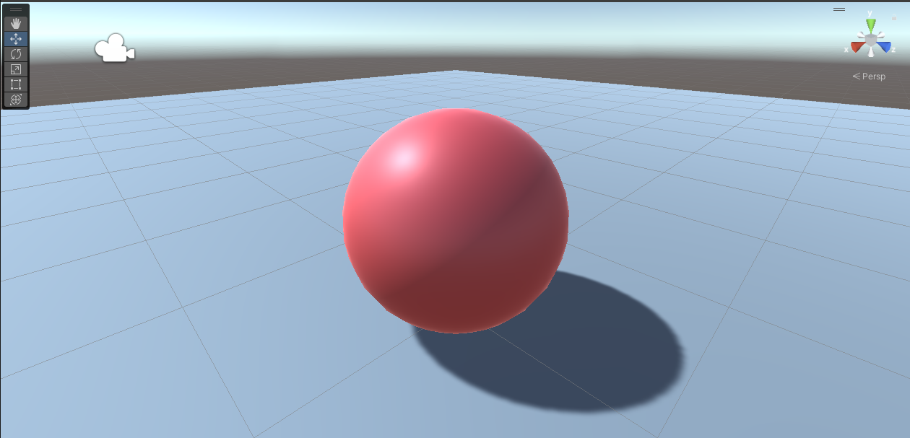

## Controlling the player

Now we get to the more exciting stuff: Interaction and moving our player around!

### Add a rigidbody

We want our ball to be rolling, so we will need the physics engine of Unity. To do that, we will add a `Rigidbody` component to our ball.

Select the player sphere, and in the inspector, click on `Add Component`. Search for `Rigidbody` and click on it.


### The input system

Now we will need to read the input from the keyboard. 

I can't believe that I am writing this but as of 2023, Unity's new input system is still not directly in the editor, we have to install it.

Let's go to `Window` -> `Package Manager`.


Then we need to show the packages from the `Unity Registry`. Click on `packages:` and choose `Unity Registry`.

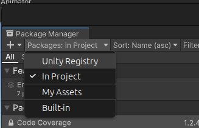

Now we search for the `Input System` using the search bar. Click on `Install`, during the installation you might get prompts, just press `yes` and proceed.


Now let's select our player sphere again, and add a `Player Input` component to it, just like we did for the `Rigidbody`. This will allow us to read the input from the keyboard.

The updated inspector will show this:


Let's click on `Create Actions` to create the actions we will need to move our player.

You will be prompted to save the actions in a folder. Create a new folder called `Input` in your `Assets` folder and save the actions there as `InputActions`.

We end up with this strange window:

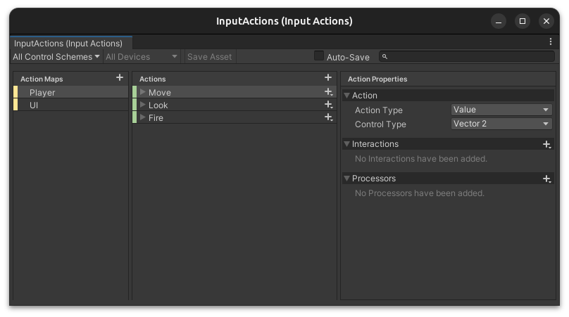

We close it for now, but we will be back!

### Scripting with C#

In Unity, scripts are used to create behaviors for objects. They are written using the C# programming language that is basically Java (another language with much more adoption), but by Microsoft. 

We will create a script to move our player around. First let's create a `Scripts` folder in our `Assets` folder, like we did for the `Input`, `Materials` and `Scenes` folders.

Now let's right click on the `Scripts` folder and choose `Create` -> `C# Script`. Name it `PlayerController`.


We can then drag and drop the script onto our player sphere in the scene view just like with the materials.

Now if we double click on the script, it will open in your default code editor. I use Visual Studio Code, but you can use whatever you want. We see the following code:

```csharp
using System.Collections;
using System.Collections.Generic;
using UnityEngine;

public class PlayerController : MonoBehaviour
{
    // Start is called before the first frame update
    void Start()
    {
        
    }

    // Update is called once per frame
    void Update()
    {
        
    }
}
```

This is the base for all behavior scripts in Unity. The Start function is called when the object is created, and the Update function is called every frame. As we are using Unity's input system, we won't actually need the Update function, you can remove it if you want.

#### Reading the input

First things first, let's tell Unity that we will use the Input system. With the other `using` statements, add the following:

```csharp
using UnityEngine.InputSystem;
```

To read the movement from the keyboard, we also need to add an `OnMove` function along side the `Start` function. It will be called every time the player moves.

```csharp
void OnMove (InputValue movementValue)
{

}
```

In the `OnMove` function, we can get the movement vector from the input using the following line of code:

```csharp
Vector2 movementVector = movementValue.Get<Vector2>();
```

We want the movement to act upon the position of the player. For that we will need access to its Rigidbody component which is responsible for its position, velocity and collisions.

Above the `Start` function, we will add a variable to store the Rigidbody component:

```csharp
private Rigidbody rb;
```

By default, this variable has no value so we must assign it in the `Start` function:

```csharp
rb = GetComponent<Rigidbody>();
```

Physics objects in Unity are not updated every frame, as the delay between each frame can vary, which would cause instabilities in the physics simulation. Instead, they are updated every fixed amount of time. 

Therefore, we won't be using the `Update` function, but the `FixedUpdate` function which is called every fixed amount of time. We will use it to apply the movement to the player.

```csharp
void FixedUpdate()
{

}
```

Now we will need to pass the movementVector of the `OnMove` function to the `FixedUpdate` function. For that we will use another instance variable (just like the `rb` variable) to store the movement vector.

```csharp
private float movementX;
private float movementY;
```

In the `OnMove` function, we will assign the values of the movement vector to the `movementX` and `movementY` variables.

```csharp
movementX = movementVector.x;
movementY = movementVector.y;
```

Finally, in the `FixedUpdate` function, we will apply the movement to the player using the `rb` variable.

```csharp
rb.AddForce(new Vector3(movementX, 0, movementY));
```

Your player script should look like this:

```csharp
using System.Collections;
using System.Collections.Generic;
using UnityEngine;
using UnityEngine.InputSystem;

public class PlayerController : MonoBehaviour
{
    private Rigidbody rb;
    private float movementX;
    private float movementY;

    // Start is called before the first frame update
    void Start()
    {
        rb = GetComponent<Rigidbody>();
    }

    void OnMove (InputValue movementValue)
    {
        Vector2 movementVector = movementValue.Get<Vector2>();
        movementX = movementVector.x;
        movementY = movementVector.y;
    }

    // Update is called once per frame
    void FixedUpdate()
    {
        rb.AddForce(new Vector3(movementX, 0.0f, movementY));
    }
}
```

Now if you go back in Unity and press the play button (or `Ctrl + P`), you should be able to move your player around using the arrow keys, the WASD keys or the left joystick of a controller. Unity's input system is very powerful and hides all the complexity of reading input from the keyboard, mouse or controller from us.

#### Changing the speed

You may feel that our ball is moving slowly. We can change that by adding a speed variable to our script (alongside the `rb`, `movementX` and `movementY` variables).

```csharp
public float speed = 1.0f;
```

Assigning the value `1.0f` to the variable means that the speed will be `1` per default. We can change it in the inspector if we want as it is a `public` variable.

And now in our `FixedUpdate` function, we will multiply the movement vector by the speed.

```csharp
Vector3 movement = new Vector3(movementX, 0.0f, movementY);
rb.AddForce(movement * speed);
```

Notice how I split the line in two to make it more readable. You should always aim to make your code as readable as possible. Afterall, source code is meant to be read by humans, not computers.

Now if you go to Unity, select the player and look for the `Player Controller` script in the inspector, you should see the `speed` variable. 

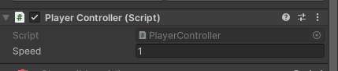

Try changing it to `2.0` (or more, you are the one making the game after all) and press play. You should see that the player is now moving faster.

## Camera Movement

You may have noticed that the camera is fixed and does not follow the player. We will fix that now.

Let's create a new script called `CameraController` in the `Scripts` folder. We will need to add a variable to store the player object, and Vector3 to store the offset between the player and the camera.

```csharp
using System.Collections;
using System.Collections.Generic;
using UnityEngine;

public class CameraController : MonoBehaviour
{
    public GameObject player;
    private Vector3 offset = new Vector3(0, 5, -7);
    
    // Start is called before the first frame update
    void Start()
    {
        
    }

    // Update is called once per frame
    void Update()
    {
        
    }
}
```

Now we only need to specity the change of position in the `Update` function.

```csharp
void Update()
{
    transform.position = player.transform.position + offset;
}
```

Now, go back in the editor, select the `Main Camera` object and add the `CameraController` script to it. 

There is also a field called `Player` in the inspector. Drag and drop the player object onto it so that the camera knows which object to follow.

While we are at it, change the X rotation of the camera to `45` so that the camera will be looking at the player from above.

When hitting play, you will see that the camera is now following the player.

## Making a better environment

Our ground plane is a bit bland at the moment. Let's add some walls, so that the player does not fall off the map to certain death.

Just like we did for the Sphere and the Plane, right click in the hierarchy, but choose `Create Empty` this time. Name it `Walls`.

Empty objects are useful to group other objects together. It will make your life easier if you want to move the walls around in one fell swoop instead of moving each wall individually.

Make sure the `Walls` have its position set to `0` on all axis.

Now right click in the hierarchy on the `Walls` object and choose `3D Object` -> `Cube`. Name it `Wall`.

Let's change its scaling to something more like a wall. Set Z to something like 20 to make it longer and X to 0.5 to make it thinner.

You can press `F` to focus on the wall and see it better.

Now we have to move it to the edge of the map. We will change its X position to 10

We have 3 walls to go! In the hierarchy, right click on the `Wall` object and choose `Duplicate`.

Now we have a second wall, but it is in the same position as the first one. We will move it to the other side of the map by changing its X position to `-10`.

For the 2 other walls, we can duplicate the second wall and change its Z position to `-10` and `10` respectively. We also need to rotate them by 90 degrees on the Y axis.

The only thing left to do it to create a material for the walls, you can proceed just like we did for the ground plane. Feel free to choose the settings you like.

My playground looks like this:

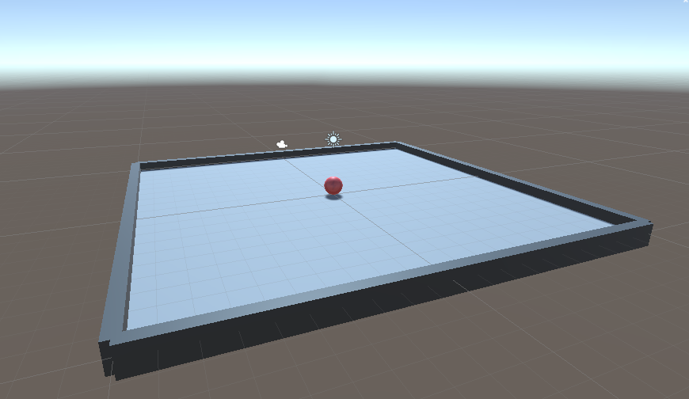

## Collectibles

Moving around is fun and all, but the player needs a goal if we are to do an interesting game. We will add some collectibles that the player will have to collect.

First, let's create a new 3D Cube object in the hierarchy. Name it `Collectible`.

To raise it from the ground, we will change its Y position to `0.5`.

The collectible will be smaller that the player, so let's change its scale to `0.5` on all axis.

And just for fun let's rotate it by 45 degrees on every axis.

### Material

We need to create a material for the collectible, just like we did for the ground plane and the walls. Choose a color that stands out so that the gaze of the player will be drawn to it. (Yellow works well and resembles gold coins).

Don't forget to drag and drop the material onto the collectible.

Also save your scene! I can't stress this enough.

### Rotation script

We want the collectible to rotate on itself (to make it stand out even more). For that we will create a new script called `CollectibleRotation` in the `Scripts` folder.

We only need to update the rotation in the `Update` function.

```csharp
void Update()
{
    transform.Rotate(new Vector3(15, 30, 45) * Time.deltaTime);
}
```

Here again, you can change the values to whatever you want. The `Time.deltaTime` is used to make the rotation independent of the framerate.

Now we can drag and drop the script onto the collectible object.

### Prefabs

Let's create a new folder in the `Assets` folder called `Prefabs`. 

Prefabs are objects that can be reused in the scene. It is really powerful as we can reuse all the work we did on this single collectible to create more of them.

Drag and drop the collectible object from the hierarchy into the `Prefabs` folder.

Now in the hierachy, we have this:

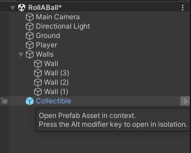

The prefab instance appears in blue and there is a little arrow next to it.

By clicking on the arrow, we enter the prefab editing mode. We can now change the prefab and all the instances will be updated. For now we only have one instance, but we will create more!

### Spawning collectibles

It's time to spawn some collectibles! First let's create a new empty gameobject called `Collectibles` in the hierarchy.

Make sure its position is `0` on all axis.

Drag our collectible inside the `Collectibles` object. This will make it a child of the `Collectibles` object.

Now just duplicate (`Ctrl + D`) the collectible a bunch of times and put them anywhere you want in the scene.

I ended up with this:

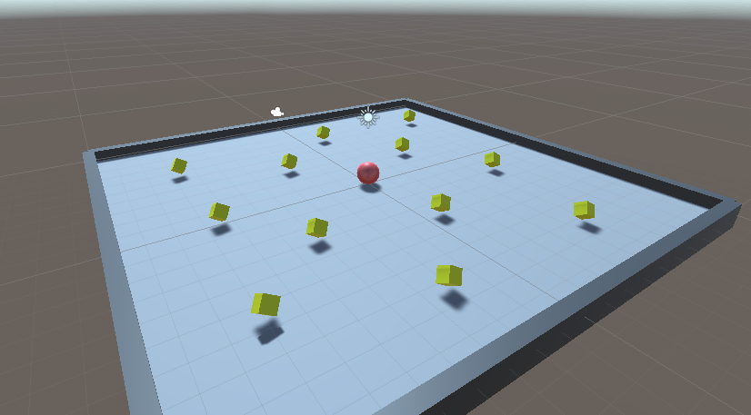

Now when we run the game, the collectibles are rotating and everything but the player collides with them instead of collecting them. We will fix that now.

### Catch'em all

To detect the collisions with the player, inside our `PlayerController` script, we will add a new function called `OnTriggerEnter`.

```csharp
void OnTriggerEnter(Collider other)
{
    
}
```

This way we can know what is the other object that collided with the player. We will use the `tag` of the object to know if it is a collectible or not. If it is, we will deactivate it.

```csharp
void OnTriggerEnter(Collider other)
{
    if (other.gameObject.CompareTag("Collectible"))
    {
        other.gameObject.SetActive(false);
    }
}
```

#### Tags?

We didn't talk about the tags! Tags are used to identify objects, and multiple objects can have the same tag. This is really useful and we will use it to identify the collectibles.

Use the arrow next to any `Collectible` prefab instance in the hierachy to enter the prefab editing mode. Select the collectible object and in the inspector, look for this:

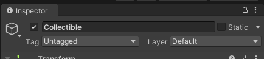

Open the dropdown menu. We already have a few tags available but we will create a new one. Click on `Add Tag...`.

We end up in this not so very ergonomic window:

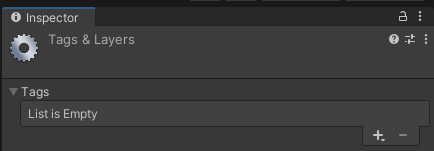

Press the `+` button to add a new tag. Name it `Collectible` and save it.

Now let's select again the collectible object in the prefab editing mode and choose the `Collectible` tag in the dropdown menu.

Now when we exit the prefab editing mode, all the instances of the collectible will have the `Collectible` tag. I told you it was powerful!

#### Triggering the trigger

We are almost there! We just need to tell Unity that the collectible object is a trigger. 

Let's select the collectible object in the prefab editing mode and in the inspector, check the `Is Trigger` checkbox in the `Box Collider` component.

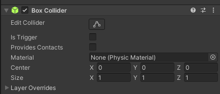

Now when we exit the prefab editing mode, all the instances of the collectible will have the `Is Trigger` checkbox checked.

Now if you run the game, you should be able to collect the collectibles. You can see that they disappear when you touch them.

## Displaying the score

For our score system, we will be simply counting the number of collectibles collected. We will display the score in the top left corner of the screen.

In our `PlayerController` script, we will add a new variable to store the score.

```csharp
private int score = 0;
```

Inside the `OnTriggerEnter` function, we will increment the score by one every time the player collects a collectible.

```csharp
void OnTriggerEnter(Collider other)
{
    if (other.gameObject.CompareTag("Collectible"))
    {
        other.gameObject.SetActive(false);
        score = score + 1;
    }
}
```

### UI

Now we can move on to the UI! 

In the hierarchy, right click and choose `UI -> Text - TextMeshPro`. This will create a new text object in the hierarchy. Name it `Score`.

If a dialog pops up, just press `import TMP essentials`.

Our `Score` object is a child of a new `Canvas` object. Select it and press `F` to focus on it.

As is is a 2D object, click on the 2D button in the top right corner of the scene view:

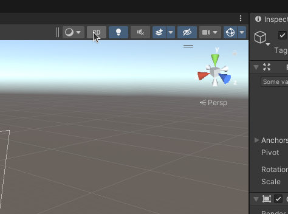

Select the `Score` object and in the inspector, change the `Text` field to `Score: 0`.

In the anchor presets, choose the top left one:

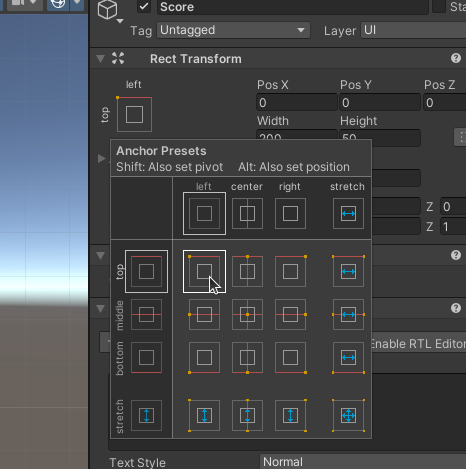

Now just set the position of the text to 0 and your score should be in the top left corner of the screen.

### Update the score ui

Now we need to update the score in the UI. For that we will need to add a reference to the `Score` object in our `PlayerController` script.

```csharp
public TextMeshProUGUI scoreText;
```

To be able to use the `TextMeshProUGUI` class, we need to add the following `using` statement:

```csharp
using TMPro;
```

Now in our `OnTriggerEnter` function, we will update the score in the UI.

```csharp
void OnTriggerEnter(Collider other)
{
    if (other.gameObject.CompareTag("Collectible"))
    {
        other.gameObject.SetActive(false);
        score = score + 1;
        scoreText.text = "Score: " + score.ToString();
    }
}
```

Don't forget to drag and drop the `Score` object onto the `scoreText` variable in the inspector of the `PlayerController` script.

And now your game works! You can move around, collect the collectibles and see your score go up. Congratulations!

## Fix the event system

As we are using the new input system, we need to fix a little something.

In the hierarchy, select the `EventSystem` object and in the inspector:

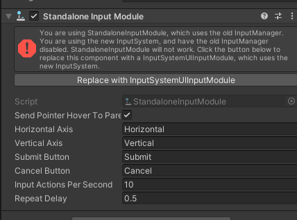

Click on the `Replace` button and you will be good.

## Build the game

Now that we have a working game, we can build it and share it with our friends! Go to `File` -> `Build and Run`. You will be prompted to save the game main executable. Choose a name and a location and save it.

Once that's done, Unity will build the game and launch it. You can now share the executable with your friends and they will be able to play it!

# Conclusion

Voilà! Now we have a working little game.

All projects files are available on Github under a free license at https://github.com/BarthPaleologue/UnityVR

We will start true VR development next week, building on what we did today. Stay tuned!

You can find the next part [here](https://barthpaleologue.github.io/Blog/posts/vr-with-unity-3/)