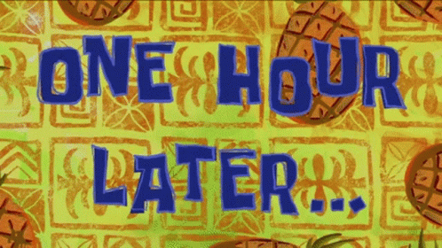
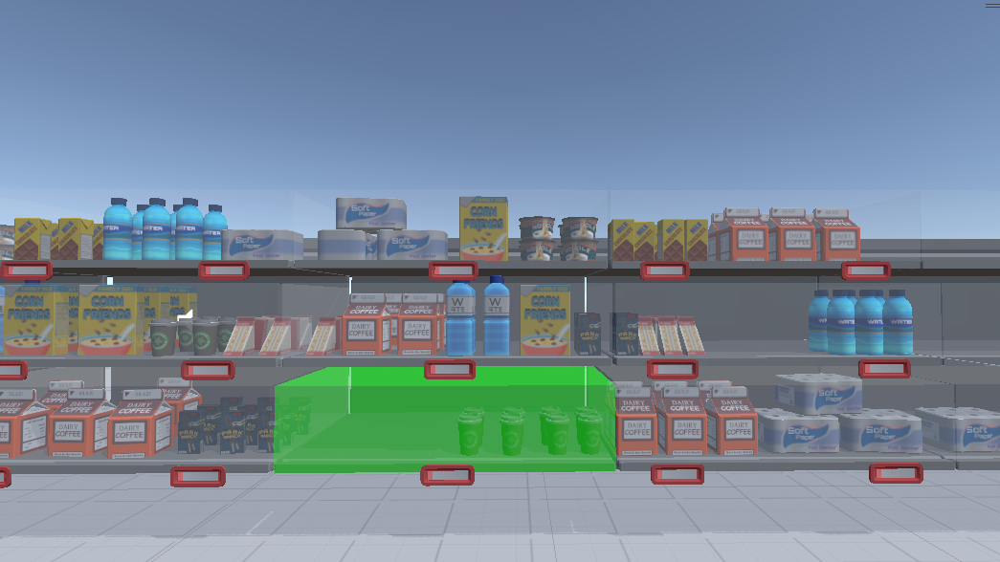
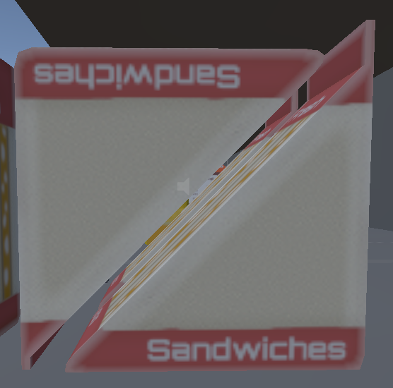
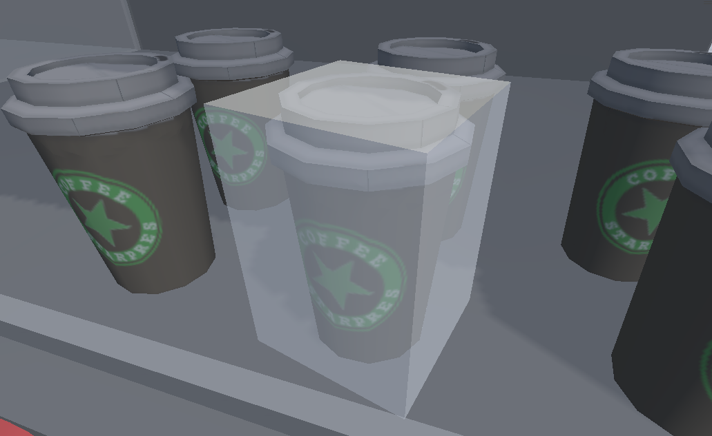
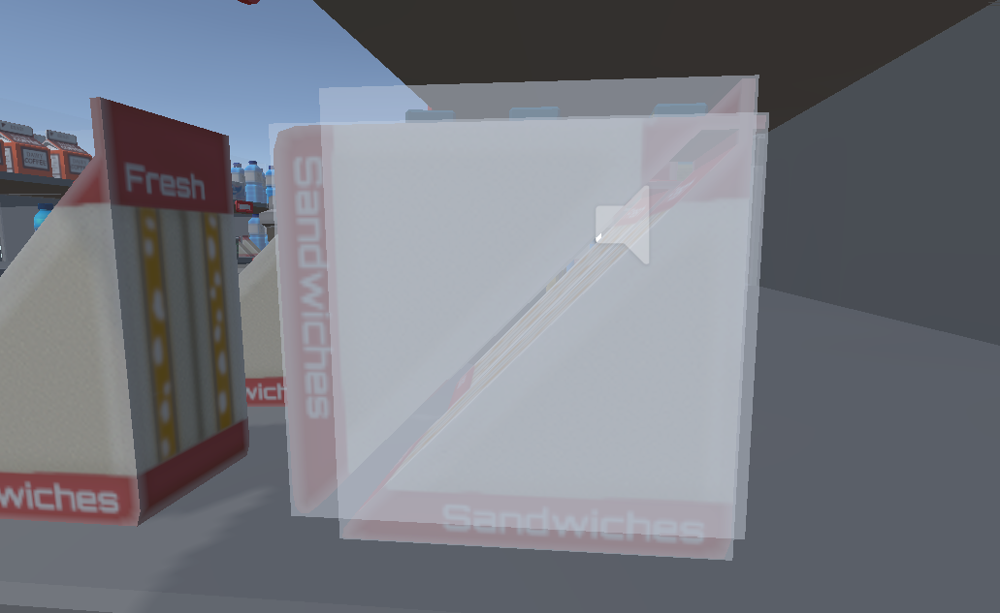
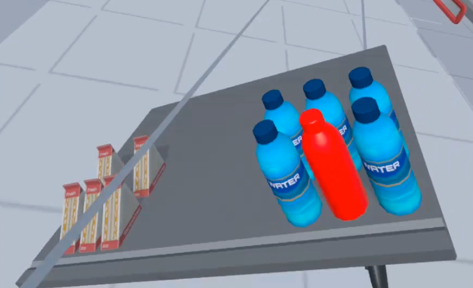

Okay the course is coming to a close and now we have to make a final project. The task is quite straightforward: select grocery items in a supermarket.

The idea is to implement one of the selection techniques of last time and test it against simple raycasting selection.

## The selection technique

As a refresher, I am going to implement grabbable shelves. The user should be able to select a shelf using raycast and have it fly in its hand where manipulation and picking with the other hand will be much easier. Here is a small video of a prototype I made reusing the code from `Roll a ball VR`:



As the user can use its hand to rotate the shelves in whatever fashion they want, it solves the issue of objects being occluded by other objects. The user can simply change the perspective to have a clear line of sight to the object they want to select.

In this blog post I will cover the implementation of the technique inside Unity. It will be divided into sections:

- Shelf highlighting
- Attaching items to shelves
- Item highlighting
- Shelf manipulation
- Item picking
- Teleportation

The evaluation of the technique will be done in the next blog post (spoilers, it is really good).

All of my implementation is available in [this repo](https://github.com/BarthPaleologue/SupermarketProject2) which is fork from our teacher's own repo.

For the project, we have access to the paid [Hyper Casual Supermaket](https://assetstore.unity.com/packages/3d/props/hyper-casual-supermarket-177794) assets from the Unity Asset Store. The repo is public so I don't know about the legality of all of this (don't sue me please), but we are using it anyway.

## Shelf highlighting

First, we have to take care of our shelves to make them compatible with the technique. We want a simpler collider so that items can be automatically attached to their shelf using a downward raycast that filters only shelves. For that we will create a layer called `Shelves` (for me it is layer 8).

There are a lot of shelves though, we aren't doing this by hand right?

Normally, we would be able to do it using scripts but the shelves do not have a script attached to them at the moment... Bummer!

Oh boy, well let's select them all by hand then.



Okay so now that we have everything selected, we can add a box collider to all of them at once, assign them to the `Shelves` layer and finally attach a `Shelf` script to them.

Now we are pretty much free to do whatever we please! We will start by adding a transparent box around the shelves that will help the user to select them later on.

To make the highlighting work, we will create a new box that we will scale so that in covers the shelf horizontally and englobes the items vertically. We will make it transparent and allow to change the color when the shelf is set to highlighted.

We also need to create another layer just for theses highlights as they will play the role of a large bounding box for the shelf. I called it `ShelvesHighlights` and is my 3rd layer.

```csharp
GameObject highlightBox;
private Color originalHighlightColor = new Color(1, 1, 1, 0.1f);
private Color selectedHighlightColor = new Color(0, 1, 0, 0.5f);    
[SerializeField] private bool isHighlighted = false;

void Start() {
    // get the size of the shelf
    Vector3 shelfSize = this.GetComponent<Renderer>().bounds.size;

    // create a new box
    GameObject box = GameObject.CreatePrimitive(PrimitiveType.Cube);

    // set layer of box to "ShelvesHighlights" (layer 3)
    box.layer = 3;

    // position the box at the same position as the shelf
    box.transform.position = this.transform.position;

    // set the height of the box
    float boxHeight = 2.25f;
    Vector3 boxSize = new Vector3(shelfSize.x, boxHeight, shelfSize.z) + new Vector3(0.01f, 0.01f, 0.01f);
    box.transform.localScale = boxSize;

    // move the box up by half its height
    box.transform.position = new Vector3(box.transform.position.x, box.transform.position.y + boxHeight / 2 - shelfSize.y / 2, box.transform.position.z);

    // set the material of the box to be transparent
    material = new Material(Shader.Find("Transparent/Diffuse"));

    // change the color of the box
    material.color = originalHighlightColor;

    // set the material of the box
    box.GetComponent<Renderer>().material = material;

    // make the box a child of the shelf
    box.transform.parent = this.transform;

    this.highlightBox = box;
}

public void SetHighlighted(bool highlighted) {
    isHighlighted = highlighted;
}

void Update() {
    // change the color of the box based on the highlighted state
    if(isHighlighted) {
        material.color = selectedHighlightColor;
    } else {
        material.color = originalHighlightColor;
    }
}
```

Now we get the following result:



You can increase the opacity of the highlights as you wish, but in VR I found this to be enough to tell the boundaries of the shelf.

## Attaching items to the shelves

Next we want to items to stick to their shelf to allow fine manipulation. We will achieve that by using parenting at startup.

All items have attached the `SelectableObject` script that we are going to modify to add the parenting logic.

The idea is that for each object, we shoot a ray downward and filter only the shelves. This should give us the nearest shelf below each object. Then we can simply set the parent of the item to the shelf and we should be good.

```csharp
// raycast downward to set parent to the shelf below (layer 8)
RaycastHit hit;
float distance = 2.0f;
Vector3 dir = Vector3.down;
if (Physics.Raycast(transform.position, dir, out hit, distance, 1 << 8))
{
    transform.parent = hit.transform;
}
```

We will also assign a new `GroceryItems` layer to all items for later raycasting purposes:

```csharp
// set layer to "GroceryItems" (layer 6)
this.gameObject.layer = 6;
```

It is important that you choose the right layer! Mine is 8 but yours could be different.

Now when we start the game in Unity and we edit the position of one shelf, we get the desired result:



## Item highlighting

In the very same fashion as we did for the shelves, we will create a highlight box for the items. This is necessary because the selection technique will not use the exact geometry of the items, so it could be disturbing for the user.

More importantly, there is the sandwich problem.



You are scared right? No? You should be!

This is a tricky edge case of box colliders, here both sandwich have a box collider that englobes the whole sandwich. Yet, as they are placed in this fashion, their bounding boxes are almost entirely overlapping. This means that one of the 2 sandwiches will be extremy hard to select as the raycast will hit the other one first.

Of solution could be to use a finer collider, but that would increase the complexity of calculations on the CPU and the original Quest doesn't have a lot of lee-way for this supermarket scene.

Instead we will use a highlight so that the user knows which objects he is about to select. This feedback mechanism will help reducing the error rate dramatically.

We will write the highlight logic inside the `SelectableObject` script. As the item already has a box collider, we will need to disable the additional box collider provided by the highlight box.

```csharp
// create a new box to representing the box collider (same scale and orientation as the object, with bounds of the box collider)
GameObject box = GameObject.CreatePrimitive(PrimitiveType.Cube);
box.transform.localScale = this.GetComponent<BoxCollider>().size + new Vector3(0.01f, 0.01f, 0.01f);
box.transform.rotation = this.transform.rotation;
box.transform.position = this.transform.position + this.GetComponent<BoxCollider>().center;

// set the box to be a child of the object
box.transform.parent = this.transform;

// remove the box collider from the box
Destroy(box.GetComponent<BoxCollider>());

// set the material of the box to be transparent
Material material = new Material(Shader.Find("Transparent/Diffuse"));
material.color = new Color(1, 1, 1, 0.3f);
box.GetComponent<Renderer>().material = material;
box.SetActive(false);

this.boundingBoxHelper = box;

public void DisplayBoundingBox(bool display) {
    this.boundingBoxHelper.SetActive(display);
}
```

We get the desired result:



And now we can tell apart the sandwiches!



## Shelf manipulation

That we will want to select shelves using our VR controllers and have them fly to our hands. The first step is to add the controller prefab to the left hand in the `OVRCameraRig` game object. I simply took the one from the right hand and duplicated it and set it as a child of the left anchor.

This way we can see both of our controllers in VR!

We will inspire from the existing Raycast technique to perform one raycast for each controller.

### Highlighting

If a ray intersects a shelf, we will highlight it. We will handle the trigger press later.

Here is the code for the right hand, the left hand is just a matter of duplicating the logic. (I know this is not the cleanest way to do it, but I don't have infinite time for this project).

```csharp
[SerializeField] private GameObject rightController;
private Shelf rightHoveredShelf = null;

private void HandleRightShelfSelection() {
    // Creating a raycast and storing the first hit if existing
    RaycastHit rightHit;
    bool hasRightHit = Physics.Raycast(rightController.transform.position, rightController.transform.forward, out rightHit, Mathf.Infinity);

    if (!hasRightHit)
    {
        // if we are not hitting anything, we should unhighlight the shelf we were hovering over
        if (rightHoveredShelf != null)
        {
            rightHoveredShelf.SetHighlighted(false);
            rightHoveredShelf = null;
        }

        return;
    }

    // if we are hitting something, we should highlight the shelf we are hovering over
    GameObject hitObject = rightHit.collider.gameObject;
    if (hitObject.tag == "shelfHighlight")
    {
        GameObject shelfObject = hitObject.transform.parent.gameObject;
        Shelf shelf = shelfObject.GetComponent<Shelf>();

        if (rightHoveredShelf != null && rightHoveredShelf != shelf)
        {
            rightHoveredShelf.SetHighlighted(false);
        }
        rightHoveredShelf = shelf;
        rightHoveredShelf.SetHighlighted(true);

        rightHandLineRenderer.SetPosition(1, rightHit.point);
    }
}
```

We can test it and see the following result:



### Shelf selection

Now that we can highlight hovered shelves, what happens when we press the trigger? We want the shelf to fly to our hand!

To achieve this, we will define the target position and rotation of the shelf to those of the controller. We can then interpolate between the original position and target position to make a smooth flying animation.

First, we have to detect single trigger presses.

Ideally, we would be using the `OVRInput.GetDown` function, but this is not working for me for some reasons. No worries, we can easily code the single press logic using `OVRInput.Get` instead.

```csharp
private bool isLeftTriggerPressed = false;
private bool isLeftTriggerPressedOnce = false;

private bool isRightTriggerPressed = false;
private bool isRightTriggerPressedOnce = false;

private void UpdateInputState()
{
    // Manage trigger press from left controller
    if (OVRInput.Get(OVRInput.Axis1D.PrimaryIndexTrigger) > 0.1f) {
        if (!isLeftTriggerPressed) isLeftTriggerPressedOnce = true;
        else isLeftTriggerPressedOnce = false;

        isLeftTriggerPressed = true;
    } else {
        isLeftTriggerPressed = false;
        isLeftTriggerPressedOnce = false;
    }

    // Manage trigger press from right controller
    if (OVRInput.Get(OVRInput.Axis1D.SecondaryIndexTrigger) > 0.1f) {
        if (!isRightTriggerPressed) isRightTriggerPressedOnce = true;
        else isRightTriggerPressedOnce = false;

        isRightTriggerPressed = true;
    } else {
        isRightTriggerPressed = false;
        isRightTriggerPressedOnce = false;
    }
}
```

We simply call it at the start of the `Update` function, and we can use the `isRightTriggerPressedOnce` and `isLeftTriggerPressedOnce` variables to detect single presses.

Now back to the part of the code where we highlight the hovered shelf, we can add a button check and a variable to store the shelf that we will manipulate (i called it `manipulatedShelf`).

As I want the user to only be able to manipulate one shelf at a time, we don't need to have a right and left version of this variable. Here is what we are going to do (there are methods that don't exist yet but don't worry, we dealing with them next).

```csharp
// Checking that the user pushed the trigger
if (this.isRightTriggerPressedOnce) {
    if (rightHoveredShelf != manipulatedShelf) {
        // if we are already manipulating a shelf, we should release it
        if (manipulatedShelf != null) manipulatedShelf.Release();

        manipulatedShelf = rightHoveredShelf;
        rightHoveredShelf.FlyToHand(rightController.transform, Hand.Right);

        state = State.ManipulatingRight;
    }
}
```

I am also introducing a state variable that help us track the state of the technique. It is a simple enum with 3 values: `Idle`, `ManipulatingLeft` and `ManipulatingRight`. I also have another enum for the hands: `Left` and `Right`.

Don't forget to implement this behavior for the left hand as well!

### Flying animation

I called two methods: `Release` and `FlyToHand` that do not exist. Let's fix that in the `Shelf` script.

We will want to store the original position, rotation and scaling of the shelf so that we can interpolate and go back to the original state. We will also have a state enum to track the state of the shelf (`Idle`, `FlyingToHand`, `Manipulating` and `Releasing`).

In the start method, we store the original transform state:

```csharp
originalPosition = this.transform.position;
originalRotation = this.transform.rotation;
originalScale = this.transform.localScale;
```

In the fly function, we will set the target position, rotation and scaling to those of the hand. We will also set the state to `FlyingToHand` and store the hand that we are flying to.

For animating purposes, we use a `timer` variable that we reset to 0 when we start flying. We will use it to interpolate between the original transform and the target transform in the `Update` function.

```csharp
public void FlyToHand(Transform hand, Hand rightLeft) {
    state = ShelfState.FlyingToHand;
    this.targetParentHand = hand;

    if(rightLeft == Hand.Left) {
        xOffset = 0.3f;
    } else {
        xOffset = -0.3f;
    }

    float distance = (hand.position - this.transform.position).magnitude;
    flySpeed = distance / 10;

    this.transform.localScale = this.targetScale;

    timer = 0.0f;

    // for every child that has layer "GroceryItems" (layer 6), set it to layer "SelectedGroceryItems" (layer 7)
    foreach (Transform child in this.transform)
    {
        if (child.gameObject.layer == 6)
        {
            child.gameObject.layer = 7;
        }
    }

    // disable the highlight box
    this.highlightBox.SetActive(false);
}
```

You can notice that we also use another layer (`SelectedGroceryItems`) that is used to filter only the items that are on the currently manipulated shelf. We also disable the hilight box of the shelf to not occlude vision when the shelf is pretty close to the eyes of the user.

The target scale is fixed to `0.1f` as I found it was quite a good size for the items to be manipulated.

You might ask what is this `xOffset` i am using here that changes in function of the hand. Without an xOffset, the shelf would be centered on the controller, which is good but not perfect. We want the shelf to be closer to the center of the view like this:



Here the shelf is held by the right hand, but is translated on the controller x axis by some offset to make it closer to the center of the view.

This helps a lot to reduce the amount of arm movement to have a good line of sight of the desired object.

In the same fashion, we have a `Release` method that does the converse to restore the original state of the shelf.

```csharp
public void Release() {
    state = ShelfState.Releasing;
    this.transform.parent = null;
    this.targetParentHand = null;

    timer = 0.0f;

    // for every child that has layer "SelectedGroceryItems" (layer 7), set it to layer "GroceryItems" (layer 6)
    foreach (Transform child in this.transform)
    {
        if (child.gameObject.layer == 7)
        {
            child.gameObject.layer = 6;
        }
    }

    // show the highlight box
    this.highlightBox.SetActive(true);
}
```

Let's animate it now! We will use our `timer` variable to interpolate between the original transform and the target transform. We will use the `Lerp` function to do so.

```csharp
if(state == ShelfState.FlyingToHand) {
    timer += Time.deltaTime;

    float t = timer / animationDuration;
    float easeInOutT = 0.5f * (Mathf.Sin((t - 0.5f) * Mathf.PI) + 1);

    Vector3 targetPosition = this.targetParentHand.position;
    // move the shelf in the forward direction of the hand and a little bit in the up direction of the hand
    targetPosition += this.targetParentHand.forward * 0.2f;
    targetPosition += this.targetParentHand.up * 0.1f;
    // move the shelf in the direction of the offset
    targetPosition += this.targetParentHand.right * xOffset;

    Quaternion targetRotation = this.targetParentHand.rotation;
    // rotate the shelf 90 degrees around the y axis
    targetRotation *= Quaternion.Euler(0, 90, 0);

    this.transform.position = Vector3.Lerp(this.transform.position, targetPosition, easeInOutT);
    this.transform.rotation = Quaternion.Lerp(this.transform.rotation, targetRotation, easeInOutT);
    //this.transform.localScale = Vector3.MoveTowards(this.transform.localScale, this.targetScale, this.scaleSpeed);

    // when the shelf is close enough to the hand, we can stop the animation
    if(this.transform.position == targetPosition && this.transform.rotation == targetRotation && this.transform.localScale == this.targetScale) {
        state = ShelfState.Manipulating;
        this.transform.parent = targetParentHand;
    }
}

// The shelf is flying away
if(state == ShelfState.Releasing) {
    timer += Time.deltaTime;

    float t = timer / animationDuration;
    float easeInOutT = 0.5f * (Mathf.Sin((t - 0.5f) * Mathf.PI) + 1);

    this.transform.position = Vector3.Lerp(this.transform.position, originalPosition, easeInOutT);
    this.transform.rotation = Quaternion.Lerp(this.transform.rotation, originalRotation, easeInOutT);
    this.transform.localScale = Vector3.Lerp(this.transform.localScale, originalScale, easeInOutT);

    // when the shelf is close enough to the original position, we can stop the animation
    if(this.transform.position == originalPosition && this.transform.rotation == originalRotation && this.transform.localScale == originalScale) {
        state = ShelfState.Idle;
    }
}
```

We are almost there! The last steps are to select items on the manipulated shelf using the other hand and giving the user some teleportation capabilities.

## Item picking

We are already making raycasts with our other hand so we will have to modify this part a bit.

Basically, if the selection ray intersects a manipulated item, we will highlight it and if the trigger is pressed we will actually select it.

If the ray does not intersect an item, we will perform the usual shelf highlighting so that the user can select another shelf if he wants to.

As we have created a `SelectableGroceryItems` layer, we can use it to filter only the items that are on the manipulated shelf.

Here is the code for the right hand:

```csharp
bool isRightShelfSelectionNeeded = true;

if (state == State.ManipulatingLeft)
{
    // We perform a raycast from the right controller on the layer "SelectableGroceryItems" (layer 7)
    RaycastHit itemHit;
    bool hasItemHit = Physics.Raycast(rightController.transform.position, rightController.transform.forward, out itemHit, Mathf.Infinity, 1 << 7);
    if (hasItemHit)
    {
        GameObject item = itemHit.collider.gameObject;

        SelectableObject selectableObject = item.GetComponent<SelectableObject>();

        this.SetHoveredSelectableObject(selectableObject);

        if (selectableObject != null)
        {
            if (this.isRightTriggerPressedOnce)
            {
                this.currentSelectedObject = item;
            }
        }

        rightHandLineRenderer.SetPosition(1, itemHit.point);
        isRightShelfSelectionNeeded = false;

        if (rightHoveredShelf != null)
        {
            rightHoveredShelf.SetHighlighted(false);
            rightHoveredShelf = null;
        }
    }
}

if (isRightShelfSelectionNeeded) HandleRightShelfSelection();
```

## Teleportation