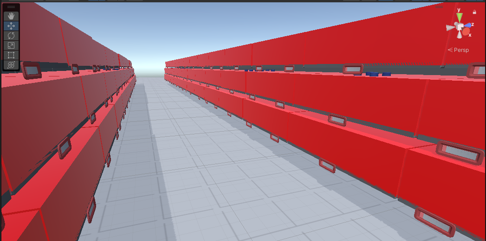
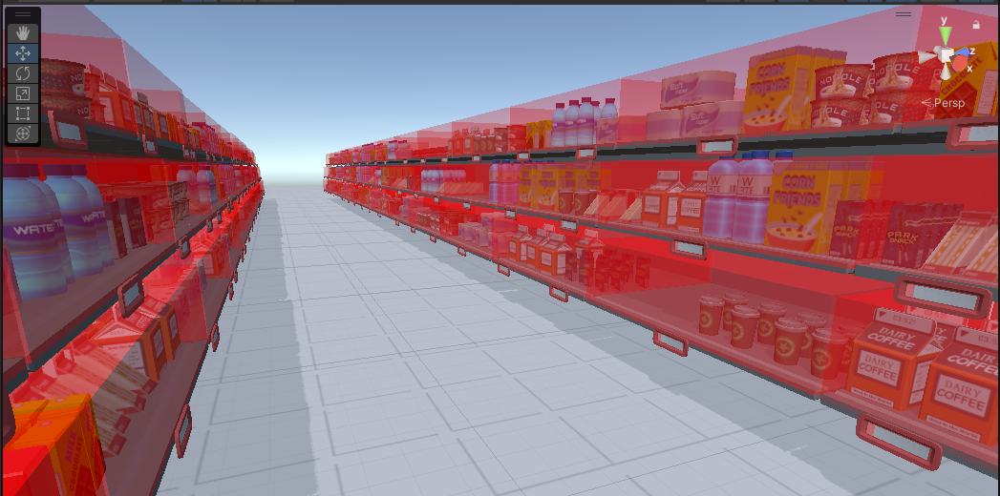
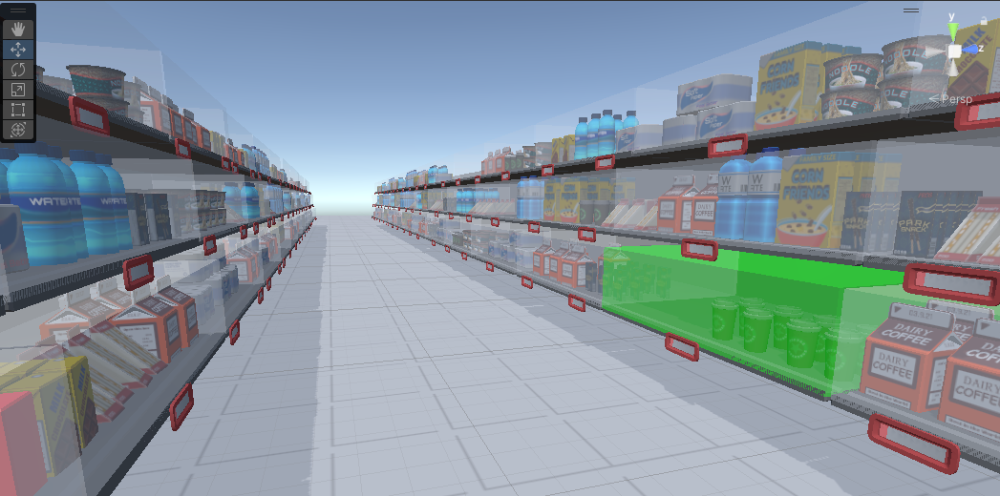

Okay the course is coming to a close and now we have to make a final project. The task is quite straightforward: select grocery items in a supermarket.

The idea is to implement one of the selection techniques of last time and test it against simple raycasting selection.

## The selection technique

As a refresher, I am going to implement the grabbable shelves idea. Here is a small video of a prototype I made reusing the code from `Roll a ball VR`:



The user can use its hands to rotate the shelves in whatever fashion they want. This solves the issue of objects being occluded by other objects. The user can simply change the perspective to have a clear line of sight to the object they want to select.

## The implementation

All of my implementation is available in [this repo](https://github.com/BarthPaleologue/SupermarketProject2) which is fork from our teacher's own repo.

For the project, we have access to the paid [Hyper Casual Supermaket](https://assetstore.unity.com/packages/3d/props/hyper-casual-supermarket-177794) assets from the Unity Asset Store. The repo is public so I don't know about the legality of all of this (don't sue me please), but we are using it anyway.

### Attaching items to the shelves

The first step to implement the selection technique is to attach the items to the shelves so that we can grab the shelf with the items on it.

To achieve this, we will create a grocery item script that will shoot a raycast downwards to find the shelf below it. If it finds one, it will attach itself to it.

Wait the shelves don't have colliders?


Oh boy, well let's add some then.


Thankfully, we can add colliders to multiple shelves at once! The only difficulty was to select all shelves without selecting any walls but it was decently fast.

I noticed that the `SelectableObject` script was automatically added to grocery items when starting the game. Therefore we can inject our attachment logic in there. Here is what I added to the `Start` method:

```csharp
// raycast downward to set parent to the shelf below
RaycastHit hit;
float distance = 2.0f;
Vector3 dir = Vector3.down;
if (Physics.Raycast(transform.position, dir, out hit, distance))
{
    transform.parent = hit.transform;
}
```

Simple enough! Now when we start the game in Unity and we edit the scene, we get the desired result:



### Adding highlight to shelves

Okay now I want to add a transparent box around the shelves that can be used to select the shelf and that can light up when the user is hovering over it.

For this we will need to add a `Shelf` script to every shelf. Do we have to select again every shelf one by one? 

Well yes, but I don't want to talk about it.

Once that's done we can write the code to create a box highlight in the `Shelf` script:

```csharp
Vector3 shelfSize = this.GetComponent<Renderer>().bounds.size;

// create a new box
GameObject box = GameObject.CreatePrimitive(PrimitiveType.Cube);

// add tag to box
box.tag = "shelfHighlight";

// position the box at the same position as the shelf
box.transform.position = this.transform.position;

// set the height of the box
float boxHeight = 2.2f;
Vector3 boxSize = new Vector3(shelfSize.x, boxHeight, shelfSize.z);
box.transform.localScale = boxSize;

// move the box up by half its height
box.transform.position = new Vector3(box.transform.position.x, box.transform.position.y + boxHeight / 2, box.transform.position.z);

// change the color of the box
box.GetComponent<Renderer>().material.color = new Color(1, 0, 0, 0.2f);

// make the box a child of the shelf
box.transform.parent = this.transform;
```

(Don't forget to create the tag `shelfHighlight` in the Unity editor, it's not done automatically)

Which gives us this awesome result:



Yeah I forgot about the transparency part I know. Let's fix it!

We simply have to add this line before setting the color of the box:

```csharp
// set the material of the box to be transparent
box.GetComponent<Renderer>().material = new Material(Shader.Find("Transparent/Diffuse"));
```



That's better.

Now we will simply add a boolean member to the `Shelf` script to indicate if the user is hovering over the shelf or not. We will then use this boolean to change the color of the box in the `Update` method:

```csharp
using System.Collections;
using System.Collections.Generic;
using UnityEngine;

public class shelf : MonoBehaviour
{
    public bool isSelected = false;

    public Material material;

    // Start is called before the first frame update
    void Start()
    {
        Vector3 shelfSize = this.GetComponent<Renderer>().bounds.size;

        // create a new box
        GameObject box = GameObject.CreatePrimitive(PrimitiveType.Cube);

        // add tag to box
        box.tag = "shelfHighlight";
        
        // position the box at the same position as the shelf
        box.transform.position = this.transform.position;

        // set the height of the box
        float boxHeight = 2.2f;
        Vector3 boxSize = new Vector3(shelfSize.x, boxHeight, shelfSize.z);
        box.transform.localScale = boxSize;

        // move the box up by half its height
        box.transform.position = new Vector3(box.transform.position.x, box.transform.position.y + boxHeight / 2, box.transform.position.z);

        // set the material of the box to be transparent
        material = new Material(Shader.Find("Transparent/Diffuse"));

        // change the color of the box
        material.color = new Color(1, 0, 0, 0.5f);

        // set the material of the box
        box.GetComponent<Renderer>().material = material;

        // make the box a child of the shelf
        box.transform.parent = this.transform;
    }

    // Update is called once per frame
    void Update()
    {
        if (isSelected)
        {
            material.color = new Color(0, 1, 0, 0.5f);
        }
        else
        {
            material.color = new Color(1, 1, 1, 0.2f);
        }
    }
}
```



## Selecting the shelves with raycasts

We are now entering the core of the project. We want the user to select the shelf using a raycast.

Thankfully, the raycast selection is already implemented in the `RaycastTechnique.cs` file. We will simply copy its content inside `MyTechnique.cs` and modify it to our needs. 

To make the project use our technique instead of the raycast technique, we will simply change the `Interaction Type` of the `TaskManager` game object to `MyTechnique` in the Unity editor.

We will start easy by highlighting the shelf when clicking on it to check everything is working fine.

Basically, we will check the tag of the raycasted object. If we hit a `shelfHighlight`, then we know its parent gameobject is a shelf. We will then set the `isSelected` boolean of the shelf to `true` to highlight it.

```csharp
// Creating a raycast and storing the first hit if existing
RaycastHit hit;
bool hasHit = Physics.Raycast(rightControllerTransform.position, rightControllerTransform.forward, out hit, Mathf.Infinity);

// Checking that the user pushed the trigger
if (OVRInput.Get(OVRInput.Axis1D.PrimaryIndexTrigger) > 0.1f && hasHit)
{
    GameObject hitObject = hit.collider.gameObject;

    // if hit object has tag "shelfHighlight" then its parent has a Shelf component and must be selected
    if (hitObject.tag == "shelfHighlight")
    {
        GameObject shelf = hitObject.transform.parent.gameObject;
        shelf.GetComponent<Shelf>().isSelected = true;
    }

    // Sending the selected object hit by the raycast
    // currentSelectedObject = hitObject;
}
```

We can test it and see the following result:



Now let's go further and make it highlight the shelf only when the user is hovering over it.

We need another variable to keep track of the currently hovered shelf so that we can disable the shelf highlight when the user is not hovering over it anymore.

```csharp
if(!hasHit) {
    // if we are not hitting anything, we should unselect the shelf we were hovering over
    if(hoveredShelf != null) {
        hoveredShelf.isSelected = false;
        hoveredShelf = null;
    }
} else {
    // if we are hitting something, we should select the shelf we are hovering over
    GameObject hitObject = hit.collider.gameObject;
    if(hitObject.tag == "shelfHighlight") {
        GameObject shelf = hitObject.transform.parent.gameObject;
        if(hoveredShelf != null && hoveredShelf != shelf) {
            hoveredShelf.isSelected = false;
        }
        hoveredShelf = shelf.GetComponent<Shelf>();
        hoveredShelf.isSelected = true;

        // Checking that the user pushed the trigger
        if (OVRInput.Get(OVRInput.Axis1D.PrimaryIndexTrigger) > 0.1f)
        {
            // we will do something here later
        }
    }
}
```

That's much better:



## Shelf manipulation

Now that we have everything in place, we can start manipulating the shelves. When the shelf is hovered and the user presses the trigger, we want the shelf to follow the user's hand.

This means we will also need to save the shelf original position and rotation to put it back when the user releases the trigger.

