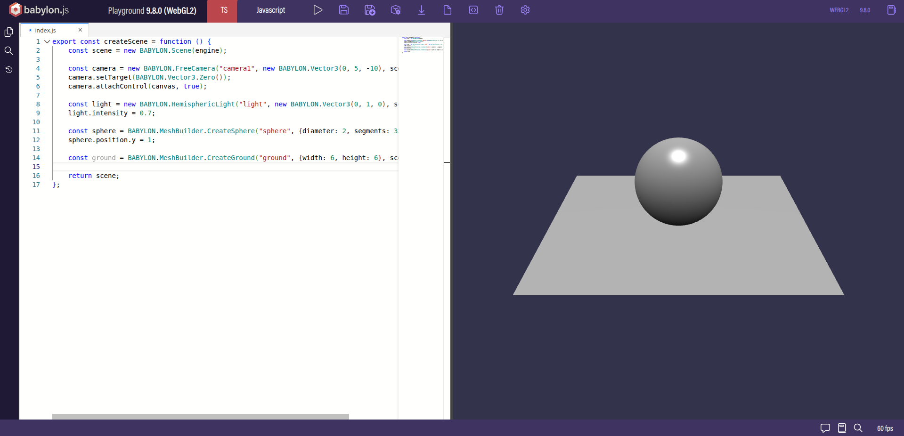
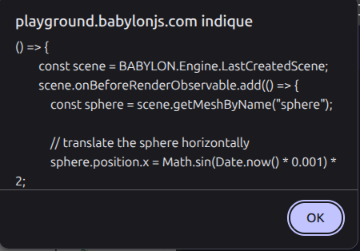
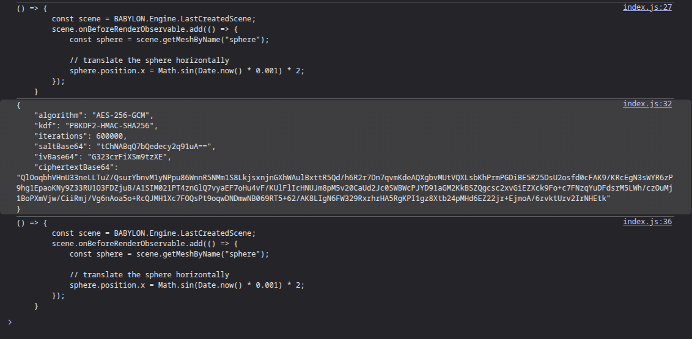

Easter eggs and game secrets are among the most fascinating and powerful aspects of video games in my experience. 

Stumbling onto one feels like taking a step outside the intended path and seeing the game reward our curiosity. We know many people will simply miss it, and that makes it feel special.

For a brief instant, there is a connection between the developer and the player, as we wonder: "what did it mean to you?".

Those moments are memorable because they feel like a direct interaction between our curiosity as players and the developer's intent.

Even more powerful are secrets that are only hinted at. Players must go out of their way to interpret clues to access the secret or easter egg. This can lead to beautiful moments of cooperation between players of the same game, all working toward a shared goal.

One video that stuck with me on this topic is the popular coverage of Shadow of the Colossus' last secret by Jacob Geller:



I recommend you watch it to see where I am coming from, and the video is just that good anyhow.

For those who don't want to watch it, here is the gist:

Scattered in the world are 4 glyphs carved in stone. Each glyph can be paired with a location of a colossus on the map. When connecting the 4 locations, you get a perfect right-angled cross intersecting over a 5th location. There, you can find a locked door that can't be opened by any known means.

This feels intentional, and one could easily believe there must be a way to open this door, and that something interesting must lie right behind it.

For years, players (the seekers) have searched for ways to open it, without success.

Eventually, someone managed to emulate the game, which let skilled players glitch through walls, get to impossible locations and basically rip the game apart.

There was nothing behind that door. It was meant to be shut.

Well that was disappointing...

The revelation triggered an existential crisis among the seeker community, but some kept going even though there was nothing to find.

Years later, a remake of the game was made for the PS4, and the seekers were granted what they always wanted: the door could finally be opened, revealing a secret chamber at the center of which a throne and sword could be found.

Nowadays, data-mining and emulation are very common. This means we can know everything that is in a game, and by subtraction, everything that is not (like the secret room that did not exist in the original version of Shadow of the Colossus). 

Furthermore, I am making an open source space exploration game ([it's called Cosmos Journeyer, check it out!](https://cosmosjourneyer.com/)), and any easter egg or secret feature I would add to the game would be trivially revealed by looking at the code, or having an AI analyze the code for this kind of secrets!

And that got me thinking. How do we make a secret that resists ripping the game apart? An unyielding yet solvable mystery that teases players from inside the game, and could survive for years or even decades.

This article focuses on the technical aspect of how to achieve such a thing. How to hint at the secret we want players to find is another rabbit hole that I hope to cover one day, once I learn how to do it!

## Demo Setup

> Disclaimer: the following will work best with interpreted languages such as JavaScript and Python. Making it work for compiled languages such as C++ or Rust would take a bit more work.

We will set up a very small demo inside a 3D web environment:

https://playground.babylonjs.com/#GBRNEJ



## Making the secret feature

Our goal will be to add a secret feature to our game: make the ball move! (Wow crazy easter egg)

The first thing to do is to program our easter egg inside a single function:

```js
const secretFunction = () => {
    const scene = BABYLON.Engine.LastCreatedScene;
    scene.onBeforeRenderObservable.add(() => {
        const sphere = scene.getMeshByName("sphere");

        // translate the sphere horizontally
        sphere.position.x = Math.sin(Date.now() * 0.001) * 2;
    });
};
```

And we can check, executing the function indeed triggers the secret feature:

https://playground.babylonjs.com/#GBRNEJ#1



## Making the secret feature secret

So how do we take this secret feature, and hide it in plain sight? We are in luck because that's exactly what cryptography is designed to achieve.

Here is how it works:
- Get yourself a bunch of data you want to hide
- Choose an encryption key (often a sentence or a number)
- Apply some complicated algorithm to your input data (the algorithm is designed to make decryption almost impossible without the decryption key)
- Share the decryption key (often the same as the encryption key) with people you trust

So how does that apply in our case?

### Preparing our feature for encryption

Starting with the data we want to hide, it is our `secretFunction`. But a function is a complex set of instructions and data, and cryptographic algorithms work at the byte level.

Thankfully we are using JavaScript, which has very advanced introspection capabilities, and so we can do some crazy things, such as dumping the source code of our function into a string at runtime:

```
const sourceCode = secretFunction.toString();
alert(sourceCode);
```



### Passphrase and encryption

Now we are getting in the nitty gritty of the topic, where we choose a passphrase and apply a cryptographic algorithm to our function.

Thankfully web browsers expose the [SubtleCrypto API](https://developer.mozilla.org/en-US/docs/Web/API/SubtleCrypto), which will let us do all that with minimal complications.

You may wonder why the "subtle" in the name? That's because the API is very easy to use incorrectly and make insecure encryption with it! So we will try our best, but remember I mostly have no idea what I am doing so you should definitely check with someone else or an AI before using this code for anything serious.

So here is a helper to encrypt our code string using a passphrase with AES-GCM (a modern and secure encryption algorithm):

```js
async function encryptSourceCode(sourceCode, passphrase) {
    const salt = crypto.getRandomValues(new Uint8Array(16));
    const iv = crypto.getRandomValues(new Uint8Array(12));
    const iterations = 600_000;

    const key = await deriveAesKey(passphrase, salt, iterations, ["encrypt"]);

    const textEncoder = new TextEncoder();
    const ciphertext = await crypto.subtle.encrypt(
        {
            name: "AES-GCM",
            iv,
            tagLength: 128,
        },
        key,
        textEncoder.encode(sourceCode),
    );

    return {
        algorithm: "AES-256-GCM",
        kdf: "PBKDF2-HMAC-SHA256",
        iterations,
        saltBase64: bytesToBase64(salt),
        ivBase64: bytesToBase64(iv),
        ciphertextBase64: bytesToBase64(new Uint8Array(ciphertext)),
    };
}
```

So what's the meaning of all of this? I am not fully sure myself! And you will notice I didn't define `deriveAesKey` and `bytesToBase64` so here they are:

```js
function bytesToBase64(bytes) {
    let binary = "";
    for (const byte of bytes) {
        binary += String.fromCharCode(byte);
    }
    return btoa(binary);
}
```

```js
async function deriveAesKey(
    passphrase,
    salt,
    iterations,
    usages,
) {
    const textEncoder = new TextEncoder();
    const keyMaterial = await crypto.subtle.importKey("raw", textEncoder.encode(passphrase), "PBKDF2", false, [
        "deriveKey",
    ]);

    return crypto.subtle.deriveKey(
        {
            name: "PBKDF2",
            hash: "SHA-256",
            salt,
            iterations,
        },
        keyMaterial,
        {
            name: "AES-GCM",
            length: 256,
        },
        false,
        usages,
    );
}
```

Here is the updated playground with the encryption helpers: https://playground.babylonjs.com/#GBRNEJ#2

So now if we call `encryptSourceCode` with the passphrase `secret` (I am better at choosing my password trust me) on the string we derived from `secretFunction`, we get something like this:

```json
{
    "algorithm": "AES-256-GCM",
    "kdf": "PBKDF2-HMAC-SHA256",
    "iterations": 600000,
    "saltBase64": "sMsARv/gbiXyY1Vy2z4Grw==",
    "ivBase64": "xvpysEKSi1GUoQaa",
    "ciphertextBase64": "7YVg0kY/D5NN17afA5T48pckE9evKkanA6ubDbQFDBtgPCnYmLJWGBTPLbKwr3roHwrnBjPuD9JfllB2vF/cxigltbFFUpmvck1hI1R7CveAK/Lms8lEbrgRvvoinrQwdE16E6yjQ3Rl/red6OBU0KzqJiRjO63i8hJUr8Uvwfr7oZ/tySniXO/j0FYIketFyPAZcdtIVhvKDp/2RBx0XRPU3YiXzUQ+n7EnbxLcvAd+DB7nGzo/1Fgalu/J6/BhBLRwHCqcuE4tztPd+J5ofrNyW4DBm52OEhZG5HbuUrjyx2J6Zj/BCWoEm1CTK7IaicRXvOsZaBOp7LFL0cV7bNXP1JPNCcTcoVfniHq9Bbj/pNTA2XFSSa9Ug89qrghE965kaILLPJ7h01lZTm16iaEB7RQJKrt6hHaMeQJg4wWI"
}
```

Absolutely unreadable... perfect! Now the source code of our function exists as this encrypted string, and no one can tell what it is unless they have the key.

> Choosing the right passphrase is paramount! An attacker using a simple dictionary for brute forcing would find the `secret` key in seconds. Prefer using an actual sentence, which will be dramatically harder to brute force.

### Decryption

Alright we managed to create an encrypted payload carrying our super secret feature, ready to be shipped with the code of the game.

Now we need to reverse the transformation when the player uses the correct key, because the feature must exist unencrypted when it is being executed.

For this we need another crypto helper (I promise those are the last ones)

```js
async function decryptSourceCode(
    payload,
    passphrase,
) {
    try {
        const salt = base64ToBytes(payload.saltBase64);
        const iv = base64ToBytes(payload.ivBase64);
        const ciphertext = base64ToBytes(payload.ciphertextBase64);

        const key = await deriveAesKey(passphrase, salt, payload.iterations, ["decrypt"]);

        const plaintext = await crypto.subtle.decrypt(
            {
                name: "AES-GCM",
                iv,
                tagLength: 128,
            },
            key,
            ciphertext,
        );

        const textDecoder = new TextDecoder();
        return textDecoder.decode(plaintext);
    } catch {
        return null;
    }
}
```

And we also need this one:

```js
function base64ToBytes(base64) {
    const binary = atob(base64);
    return Uint8Array.from(binary, (char) => char.charCodeAt(0));
}
```

And here is the updated playground with all the crypto helpers we need: https://playground.babylonjs.com/#GBRNEJ#3

We can test it by making an encryption round trip:

```js
const sourceCode = secretFunction.toString();
console.log(sourceCode);

const passphrase = "secret";

encryptSourceCode(sourceCode, passphrase).then((encrypted) => {
    console.log(JSON.stringify(encrypted, undefined, 4));

    return decryptSourceCode(encrypted, passphrase);
}).then((decrypted) => {
    console.log(decrypted);
})
```

If you look at your console output in the browser dev tools, you will see that what you get at the end is the same as your input:



The updated playground code is available here: https://playground.babylonjs.com/#GBRNEJ#4

> Note that once the payload is decrypted, the user can inspect the memory of the program to find the source code of the secret feature. They will likely and rightfully leak the code as well as the passphrase, so the feature won't be secret anymore. That's why you should use these techniques only for the hardest easter eggs, those you expect to be discovered years after the release of the game.

### Execution

Alright we got back our function's source code from the encryption hell it was trapped in! But how do we make it run? Right now it's just a string...

Once again JS to the rescue! As we can convert functions into strings, we can convert strings back into function using the very dangerous `eval` function. 

Basically `eval` takes a string of JavaScript source code, and just executes it. What could go wrong?

> Example of bad usage: Make a social media where we run `eval(username)`. A single malicious user can now execute any code it wants on any computer where its username appears. NOT GREAT!

So let's try it, the first thing is to stop executing our `secretFunction` every time to make room for our new experiment: https://playground.babylonjs.com/#GBRNEJ#5

We take our `decrypted` string, and let's make it a js function again:

```js
eval(decrypted);
```

Ok nothing happened? Ah yes, we also need to call it:

```js
const decryptedSecretFunction = eval(decrypted);
decryptedSecretFunction();
```



It works! We successfully decrypted our secret feature, and ran it, changing the behavior of the scene. And no one could have guessed what the feature would do!

...

What do you mean the source code of the secret feature AND the passphrase are written in plain text inside of the playground? 

Ok fine, onto the last step of our journey then.

## The final nail in the coffin

And for our last trick, let's get rid of the secret feature source code.

The first thing to do is to get the encrypted payload of our function using our chosen passphrase (I will keep using `secret` because I am lazy) and inject it in our code:

```js
const superSecretPayload = {
    "algorithm": "AES-256-GCM",
    "kdf": "PBKDF2-HMAC-SHA256",
    "iterations": 600000,
    "saltBase64": "sMsARv/gbiXyY1Vy2z4Grw==",
    "ivBase64": "xvpysEKSi1GUoQaa",
    "ciphertextBase64": "7YVg0kY/D5NN17afA5T48pckE9evKkanA6ubDbQFDBtgPCnYmLJWGBTPLbKwr3roHwrnBjPuD9JfllB2vF/cxigltbFFUpmvck1hI1R7CveAK/Lms8lEbrgRvvoinrQwdE16E6yjQ3Rl/red6OBU0KzqJiRjO63i8hJUr8Uvwfr7oZ/tySniXO/j0FYIketFyPAZcdtIVhvKDp/2RBx0XRPU3YiXzUQ+n7EnbxLcvAd+DB7nGzo/1Fgalu/J6/BhBLRwHCqcuE4tztPd+J5ofrNyW4DBm52OEhZG5HbuUrjyx2J6Zj/BCWoEm1CTK7IaicRXvOsZaBOp7LFL0cV7bNXP1JPNCcTcoVfniHq9Bbj/pNTA2XFSSa9Ug89qrghE965kaILLPJ7h01lZTm16iaEB7RQJKrt6hHaMeQJg4wWI"
}
```

Now that the encrypted payload is written directly inside the source code, we can get rid of the encryption helpers (`encryptSourceCode` and `bytesToBase64`). Instead of calling `encryptSourceCode`, we pass `superSecretPayload` to `decryptSourceCode`. We also get rid of `secretFunction` as we will only be using its encrypted form.

To ask the user for the passphrase, we can use a simple `prompt`:

```js
const passphrase = prompt("Enter passphrase");
```

And once that's done, there it is: there is no trace left of our secret feature and passphrase. Even with access to the source code, no one can access our easter egg without knowing the passphrase. We did it!



## Parting words

Well that was fun! (Well at least I had fun). We now have a blueprint to make very robust enigmas where seekers can scratch their head for years before finding the solution, without being able to cheat by reading the code or by hacking their way through it.

This still leaves a lot of room for improvements, for example the first player to find the passphrase could leak it and then there is no point in keeping the code encrypted. Let me know if you have ideas to make it better!

You can use all of this code for your own projects, and adapt it to your liking. If it comes up, attribution is always appreciated of course :)
