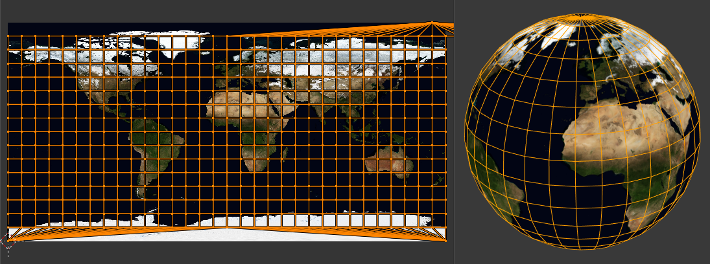
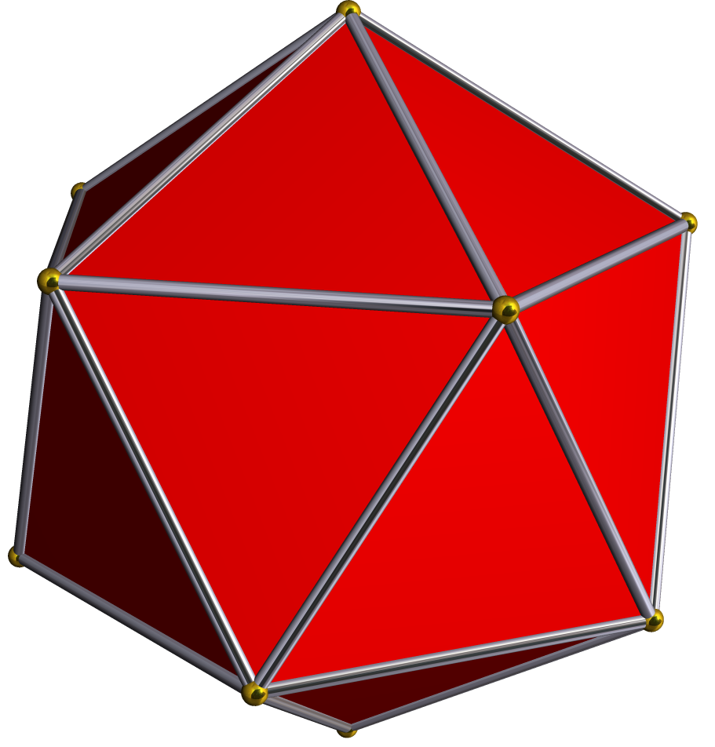
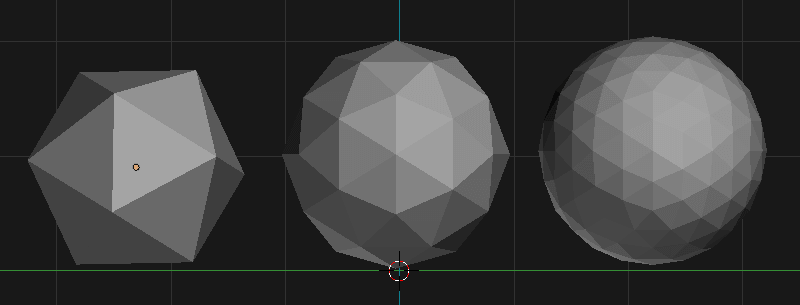
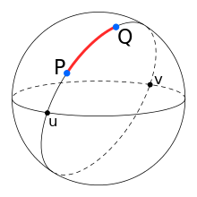

## Introduction

Planetary rendering is hard. The scales at play can go from the small butterfly in a patch of grass to an entire continent viewed from space. As always, computer graphics is all about finding tricks to fake a realistic look to the player.

The most important trick, and the first one I implemented for [Cosmos Journeyer](https://cosmosjourneyer.com) is the terrain level of detail. The goal is to be able to have a detailled surface only where it is needed: close to the camera where it will be seen by the player.

I recently reworked this system, and I wanted to share my insights with you.

## Chunking

In order to have this variable level of detail, we have to split our planet surface into smaller chunks that we will be able to control separately: we don't want to have the same level of detail for the entire planet. 

When working on a flat surface, the most straightforward chunking method is the grid: cut the terrain regularly along the two directions of space and you are good to go.

TODO: an illustration of a grid chunking

Unfortunately, when dealing with a sphere, the grid approach is not so natural anymore. This makes us ask the fundamental question: what is a sphere?

### Finding the best spheres

You see, there is not one sphere and not all spheres are born equal, some are more equal than others, let me explain.

In computer graphics, a sphere is only a mesh where the vertices all happen to be at the same distance from a center point. How we lay those vertices can have a huge impact on our ability to process the sphere for chunking.

#### UV Sphere

The most common way to create a sphere is to take inspiration from world maps: a 2d plane that can be wrapped around a sphere like shown on this image from Blender's documentation:

This is called a UV sphere.

As you can see, this sphere does not have a uniform distribution of vertices, they get crowded at the poles and sparse at the equator. This is not ideal for planet rendering as the surface will not look good on the pole singularity. Moreover, chunking it is not trivial!

#### Icosphere

Another popular way is to start with an icosahedron:

And then we subdivide each triangle into 4 smaller triangles, like a Triforce or a Sierpinski triangle depending on your cultural preferences:

You can tell that the vertex distribution is much more uniform than the UV sphere, however once again cutting it into chunks is not trivial.

#### Cube Sphere

The third popular option is to start with a cube! Quite counter intuitive I know. The thing is, the surface of a cube is made of squares, and each square is trivially cut into 4 smaller squares. If we could find a way to make it spherical, that would be ideal for the chunking.

But what about the vertex distribution? Well, let's try it and we will see!

Here is our base cube:

TODO: illustration of a cube

Now a sphere, as we discussed earlier, is a mesh where all the vertices are at the same distance from a center point. This mean that for each vertex, we can set its distance to the center to a fixed value and we get the following cube sphere:

TODO: illustration of a cube sphere

Well its not perfect, we can see the vertex density tends to be higher at the corners of the cube, but it's a good middle ground compared to the ico sphere which has a perfect distribution but is harder to cut into chunks.

I have been using the cube sphere for my planet surfaces for 3 years, and I still think it's the best compromise. You can also have a look at [cat like coding improvement of the base cube sphere](https://catlikecoding.com/unity/tutorials/cube-sphere/) to go further.

## Quadtrees

Now we know how to cut our planet surface into smaller chunks. Now the only question, the HARD question is: when do we cut to add details, and when do we merge chunks to save on performance?

I invite you to think about it for a few seconds.

The intuition behind it is quite sensible: when the camera gets closer to the ground, we want the closest chunk to subdivide to increase the level of details. When the camera gets further away, we want to merge the chunks to save on performance.

## My mistakes

As always the devil lies in the details, and I have encountered a ton of edge cases while implementing this piece of software. I will know tell you about some of them, so that my failures can be your successes.

### LoD Oscillation

Let's say we have a distance threshold at which we decide wether to subdivide or merge chunks (let's say twice the size of the current chunk).

Let's start with a chunk of LoD `L`:

TODO: illustration of a chunk of LoD L

As the camera is close enough (below the threshold), we will now subdivide this chunk into 4 smaller ones of LoD `L+1`:

TODO: illustration of a chunk of LoD L+1

But now, the threshold has changed, and the camera is far enough (above the threshold), we will merge the 4 chunks into a single one of LoD `L`:

TODO: illustration of a chunk of LoD L

And we are back to our starting point. We can keep doing this until infinity, I call it LoD oscillation. The lesson from this mistake is that using the same distance threshold for subdivision and merging is not a good idea.

### Distance to a chunk

The next one is more subtle. How do we compute the distance to a chunk?

Well if you are like me you will just get the distance between the camera and the position of the chunk mesh and we are done.

While this works really well for very large chunks, something annoying happens when we get to a higher LoD with smaller and smaller chunk:

TODO: illustration of the discrepancy between the distance to the chunk and the distance to the surface

As you can see, at low LoD, the distance between the chunk position and the actual surface made of vertices is quite negligible compared to the size of the chunk itself. However, if you take a small chunk of mount Everest, your vertices will be displaced upward quite above the chunk base position, to a point where this distance becomes larger than the chunk size itself.

This is very problematic because you physically cannot get close enough to the chunk's actual position to trigger a subdivision, which will cause the terrain to be stuck on a coarser level and look bad.

The lesson from this mistake is that using the distance between the camera and the chunk's position is not a good idea.

## A more robust system

I spent a few hours trying to make the original system work, by computing the average height of each chunk for example, but I convinced myself that it was not worth it: I threw it all to the trash and started anew. When you cannot get rid of all the edge cases, it is a sign that your system is fundamentally flawed.

The new system creates a score for each chunk based on its distance to the camera, and the distance of the camera to the closest chunk. This score is then directly used to compute the LoD of the surface.

This new method is much more robust and I am quite happy with it.

### Great circle distances

The first part of my new system is to express that chunks further away from the camera should have a lower LoD. For this we will need a way to compute the distance between the chunk and the camera.

For this part of the algorithm, we don't care about the distance of the camera to the planet, so we will use its projected position on the sphere.

Computing distances on the surface of a sphere is different as when we are doing it on a 2d plane. The shortest path is no longer as straight line, which means the distance between two points is no longer the euclidean distance.

Instead we use the great circle distance, which is the length of the shortest arc connecting two points on a sphere. 

The formula to compute it is as follow for a point `p` and a point `q` on a sphere of radius `r`:

$$
D_{c} = r \times \arccos (\frac{p}{r} \cdot \frac{q}{r})
$$

Now we can use this formula to get the distance between any chunk, and the projected position of the camera of the sphere.

The idea is that a chunk that is twice as far away from the camera should be twice as coarse. As our subdivision algorithm is based on powers of two, it means we want the LoD to be one less for each doubling of the distance.

We can express that using the powerful logarithm function: (here we use the base 2 logarithm)

$$
\text{LoD} = \text{lod}_{max} - \log_2(D_c)
$$

### Distance to the planet

We ignored the distance to the planet until now but it is very important. In fact we want our LoD to be twice as coarsed when the camera is twice as far away to the planet surface (we will be using logs again!).

But first how do we compute the distance to the planet?

We cannot choose the distance to the sphere, as the terrain surface is displayed vertically. We want to avoid the second mistake from before.

The simplest solution here is to compute the distance between the camera and the sphere which has a radius of `r` + `max_terrain_height`. This way, we can ensure the camera will always be able to get close enough to the terrain to trigger a subdivision.

When the camera is below the max terrain height, we will simply clamp the distance to 0.

This has one negative side effect: all finest chunks are loaded at the max elevation, which is technically a waste of resources as the camera is still too far to get the full advantage of the higher resolution. This is a tradeoff I am willing to make for now, but I definitely want to improve on this in the future. 

We can update our LoD formula to take into account the distance to the planet:

$$
\text{LoD} = \text{lod}_{max} - \log_2(D_c) - \log_2(D_p)
$$