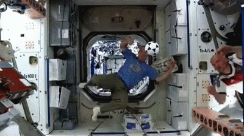
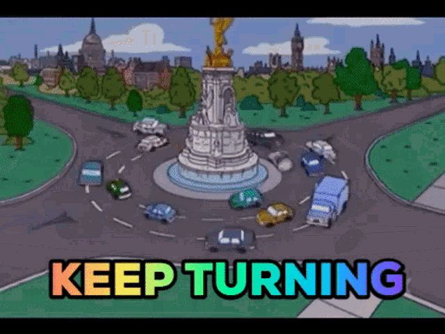
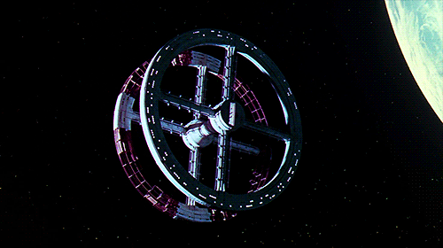
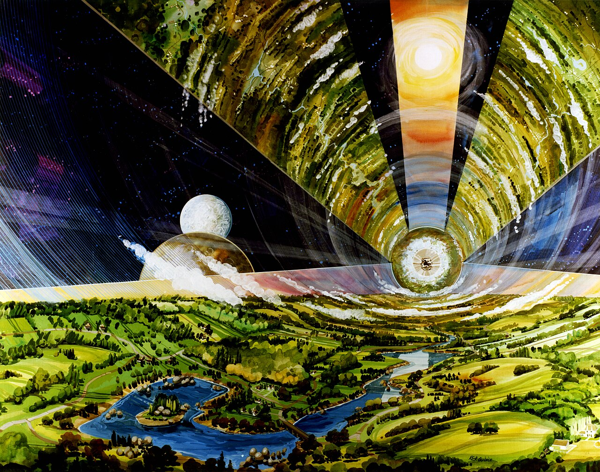
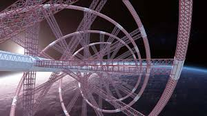
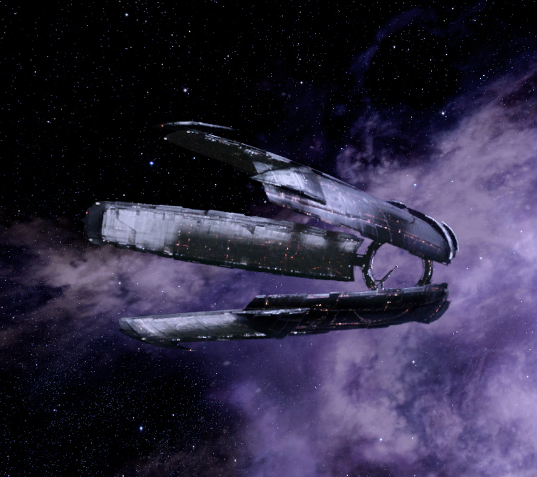

Hello again! 

This is the 2nd post of the procedural space station series aiming at creating realistic space station for [Cosmos Journeyer](https://cosmosjourneyer.com) through the awesome power of science! The previous post about energy is not required to understand this one, but you can read it [here]() if you are interested.

In the previous article, we created a model for the surface of solar panels needed to power our space stations. But we also need to create habitable sections where people will live their life in comfort, just like you are doing right now I hope ^^ (make yourself at ease!)

So today we are looking into space habitat design and their required size! I initially thought about making a single article about this topic, but it got a bit out of hand and I want to keep this digestible. 

This part will cover the general design of the habitats and the maths of artificial gravity while the next one will be all about the population density and food supply of our space stations.

## How to make artificial gravity

If humans are to live in space in the future, we will need to carry the comfort that we enjoy on Earth to our space habitats. But there is an issue: gravity.

When orbiting celestial bodies, human experience what is called "zero g" or microgravity, i.e free-fall. That's why astronauts in the ISS appear to be floating inside the station. The gravitational field of Earth is there, but they are feeling it because of the free-fall.

The impact of 0g to the human body have been and still is extensively studied by space agencies around the world. The main takeaways are the following: muscle mass loss, bone loss, vision issues because body fluids will put pressure to the top of your body and the list goes on.

This means microgravity is not possible for sustainable human presence in space. We need to carry gravity with us somehow.

Science-fiction stories have multiple for this problem such as paragravity tech, sticky floors or centrifugal force in rotating habitats.

### Paragravity

Paragravity is the lazy explanation for artificial gravity in sci-fi. You just have this magic device that generates gravity in your spaceship so you don't have to worry about anything: it just works. This is how it works in Star Wars for example, and a lot of soft sci-fi in general. There have been some work on the controversial "gravitomagnetism", but it feels a bit like the EM drive, so not super grounded in science.

### Sticky floors

Magnetic floors like in The Expanse, or velcro floors like in 2001 are very simple to implement, and on paper it seems like a good idea:



You can actually walk on the ground! Huge improvement compared to microgravity already. So what is wrong here?

Even though your feet are attached to the ground, the rest of your body does not experience any force toward the ground. All the previous health issues will still apply. Not to mention that you must walk very slowly to avoid being ejected from the ground, at which point we are back to free floating like in the ISS. 

### Centrifugal force

That leaves us with centrifugal force, which is also present in 2001 (such a visionary movie!).

Think about driving a car. You arrive at a very sharp turn at full speed. What will happen to you? As you take the turn, you will feel pulled toward the exterior of the turn, like a force is pulling you. This is what we call the centrifugal force. It is created by the conflict between your initial trajectory (which is going in a straight line), and the trajectory taken by the car (in a circle).

Now image that your car is endlessly turning around a roundabout. Very fast. Faster. 

The force pulling you toward the exterior of the turn will get stronger and stronger the faster you go. (Here we suppose that the car adheres perfectly to the road at any speed which is obviously not true but bear with me for a second).

If you go fast enough, the force pulling you will become greater than gravity itself. At this point you could theoretically stand on the car door and not fall toward the ground. This is in essence artificial gravity.

The space equivalent to the roundabout is the rotating ring habitat like in 2001:

Given a large enough ring, spinning fast enough, you can walk inside the ring just like you would on the surface of Earth! And we are not limited to rings either, we can also do O'Neel cylinders like in Rendez-vous with Rama:

And also anything in between like helixes:

or the Citadel from Mass Effect:

## The maths of artificial gravity

Oh no it's the maths again! They really get everywhere don't they?

What we want to do now is compute how fast these rings/helixes/cylinders must spin in order to simulate earth gravity.

As the rotation speed will be constant as well as the radius of the habitat, we can use the physics of the uniform circular motion, giving us the expression of the acceleration experienced by our inhabitants:

$$
a = \frac{v^2}{r}
$$
$$
\text{where v is the rotation speed in m/s and r is the radius of the habitat in m }
$$

The rotation speed is not very useful by itself, we are more interested in the rotation frequency, or its inverse the rotation period. Thankfully, we have the following relation:

$$
v = 2 \pi f r = 2 \pi \frac{r}{T}
$$
$$
\text{where f is the rotation frequency in Hz and T is the rotation period in s }
$$

We can then replace `v` by this new expression in the acceleration formula:

$$
a = \frac{4 \pi^2 r^2}{rT^2} = \frac{4 \pi^2 r}{T^2}
$$

We find the value of the rotation period by isolating `T`:

$$
T = 2 \pi \sqrt{\frac{r}{a}}
$$

If we want the inhabitants to experience the same gravity as earth, we simply plug `a = 9.81m/s²` and the ring radius that we want. For a radius of 1km, we get a rotation period of 1 rotation every 63 seconds, so about 1 rpm (rotation per minute).

## How big do we want this ring?

We still have to choose the radius of the habitat wisely. Of course it depends on the number of people we want to house, but there are also some physical considerations we must look at.

### I feel light headed

As the gravity generated by ring depends on the distance to the center, it is slightly different for your head and your feet. The gravity is interpolated between 0 at the habitat center, to its maximal value of earth gravity on it's outer surface. If the ring is very small like a few meters wide, the difference will be very noticeable and your head will literally be lighter than the rest of your body. This creates health issues where most of your blood will be in the bottom of your body, starving your brain for oxygen. The same phenomenon is responsible for the Spaghettification experienced near black hole singularities.

We will denote this acceleration difference as so:

$$
\Delta a = a - a_{head}
$$

We want this delta to be less than 1% of the generated gravity so that the inhabitants cannot feel the difference:

$$
\frac{\Delta a}{a} = \frac{a - a_{head}}{a} < 0.01
$$

Most humans are less than 2m high, so we will use this value for the distance between the head and the feet.

$$
\frac{\Delta a}{a} = \frac{\frac{4 \pi^2 r}{T^2} - \frac{4 \pi^2 (r-2)}{T^2}}{\frac{4 \pi^2 r}{T^2}}
$$

We can simplify the expression:

$$
\frac{\Delta a}{a} = \frac{r - (r-2)}{r}
$$

This can be simplified further:

$$
\frac{\Delta a}{a} = \frac{2}{r}
$$

Remember, we want this relative variation to be less than 1%. We have now a much nicer equation:

$$
\frac{2}{r} < 0.01
$$

We can now isolate `r`:

$$
r > \frac{2}{0.01}
$$

Giving us this final result:

$$
r > 200m
$$

There is our answer. Our habitats will need to be at least 200m radius wide in order to avoid the health and comfort issues caused by the gravitational gradient.

### Coriolis force

This is not the end of our troubles because I still did not talk about the Coriolis force. Here is an illustration from wikipedia:

In this image, the sphere falls to the ground as expected from the external point of view. But from the point of view of someone rotating with the station, the ball falls along a curved trajectory which is deeply disturbing if you experience it in some science exhibitions.

We also want to the coriolis force to be minimized to avoid motion sickness for our inhabitants. 

The coriolis force depends on the speed of the moving object it is applied to. It's acceleration can go up to:

$$
a_{max coriolis} = 2 \omega v
$$ 
$$
\text{where: } \omega = \sqrt{\frac{a}{r}} \text{ and v is the speed of the moving object in m/s}
$$

As we want to minimize the effect of the force, we must consider the worst case scenario. That means we must consider the max speed for an object inside our space stations.

As I envision them like our modern cities, I expect some form of public transportation to go from one place to the other. [According to wikipedia](https://fr.wikipedia.org/wiki/Tokyo_Metro), the metro in Tokyo can go as fast as `100km/h`, which is about `30m/s`. I think this is a reasonable upper bound for the speed of objects in our space cities in the everyday life of its citizens.

Now we want to ensure the coriolis force of this worst case scenario won't exceed 1% of the artificial gravity field:

$$
\frac{a_{max coriolis}}{a} = \frac{2 \sqrt{\frac{a}{r}} v}{a} < 0.01
$$

This can be simplified to

$$
\frac{2 v}{\sqrt{ra}} < 0.01
$$

We can now isolate `r`:

$$
\sqrt{r} > \frac{2v}{0.01\sqrt{a}}
$$

We square both side to get:

$$
r > 10000 \frac{4v^2}{a}
$$

By replacing `a = 9.81m/s²`, `v = 30m/s`, we get our minimal value for `r`:

$$
r = 3700km 
$$

Well shit that's more than I expected! For reference, the radius of planet Earth is `6300km`. So obviously we are not going to build a planet size space station.

We have 2 solutions there: either lower the maximal speed of objects in the space station, or increase the tolerance to coriolis from this 1% value we decided pretty arbitrarily.

For example, choosing a tolerance of 10% reduces the required radius by a factor 100: down to `37km`!

## Conclusion

In the end, the most credible source of artificial gravity is achieved with rotating space habitats. They can have any shape as long as the people live at the same distance from the rotation axis.

The gravity gradient is easily solved by using a radius at least 100 times bigger than the size of a typical human being.

Unfortunately we also must account for the elusive Coriolis force, which applies to objects moving in the space station, and depends on the speed of said motion. Assuming our space citizens use public transportation that does not exceed 100km/h, it is very hard to completely suppress the effects of the Coriolis force without building a planet size space station.

In the end it seems the ideal space station is one with a radius of a few tens of kilometers, which seems achievable. The rotation frequency of the habitat is easily computed using a simple formula we found from the physics of uniform circular motion.

Next time, we will study food supplies for our citizens, and how it affects population density. This will give us a rough estimate of the total surface necessary for our space city that we can use to generate procedural space stations with.

## References

PHYSICS OF ARTIFICIAL GRAVITY by Angie Bukley, William Paloski and Gilles Clément: https://ntrs.nasa.gov/api/citations/20070001008/downloads/20070001008.pdf