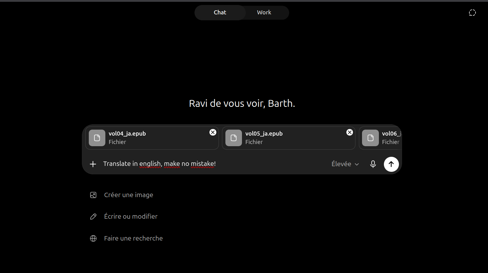
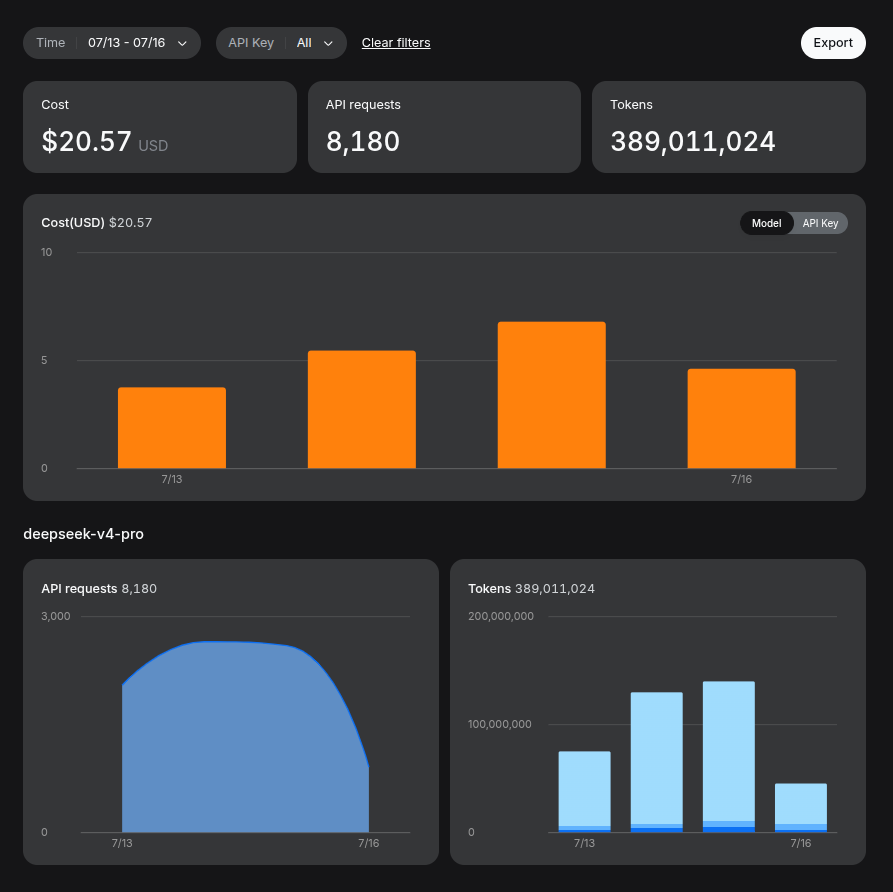

## We are doing translation now? 

In recent months, my partner and I have been reading the english translation of "Legend of the Galactic Heroes" (LOGH) from the japanese original by Yoshiki Tanaka.

While I usually avoid reading books in english as it is not my native language, this translation felt effortless to read.

Everything changed when ~~the fire nation attacked~~ we started reading the 4th book. You see, the translator changed: the first 3 books were translated by Daniel Huddleston, while the next 3 were translated by Tyran Grillo. (There are 4 more books afterward, but we don't care about them today).

Some passages felt very confusing to read with many indirections, and some contradictions as well. The kind of stuff that will make you lose your motivation to read.


I don't want to throw shade at Tyran Grillo here, there is no telling how much time and money he was given to translate those 3 books, and even the most talented translator would fail under inferior working conditions. Any attempt at building bridges between cultures should be celebrated.


Facing this problem, what can we do to keep reading the series? I identified 3 options:
- find another translation
- learn japanese to read the source material
- create a new translation from scratch   


This article will talk about LLMs and the ethics of using them. The article itself was painstakingly written by yours truly (a human), and proofread by both humans and LLMs for correctness and idiomaticity of some sentences. I hope you will find it interesting, no matter what your opinion of AI is.


Let's find out!

## Human translation efforts

The easiest solution by far would be to find another suitable translation. From what I could find, there is no other english translation for book 4 to 6.

There was [a community-led project](https://legendofgalacticheroes.blogspot.com/) to translate all the books but it seems they only got around to translate the first one, before sadly stopping in 2015.

I also checked for translation in my native language (French), and found [a crowdfunding project](https://fr.ulule.com/les-heros-de-la-galaxie/)! However the first book is set to release in 2027 so the 4th book is likely a few years away, and I won't wait that long.

## Learning japanese?

Well I did take some japanese classes at school, but it doesn't go much further than "Watashiwa Baruterumidesu, yoroshiku onegaishimasu. O genki desuka?". 

I already have a full-time job and [making a video game in my free-time](https://cosmosjourneyer.com). I can't even find time to play music so me learning an entire language is unlikely to say the least.

## Making a new translation

Our list of options is already growing thin. Looks like we will need to make a new translation, or stop reading the books.

### Hiring a human professional

The gold standard for making a new translation is to hire a professional to do it for us. My wallet is finite however, so we need to watch out the cost. 

It seems hiring a professional english translator costs [between 0.12$ and 0.16$ per word](https://pen.org/report/fairness-in-publishing). Given 3 books of 200 pages, averaging 90k english words per book (270k words total), we can estimate the cost at `270k * 0.14 = 38k$` for those translations.


You see I don't have that much money, and if I did I would likely use it for something else than re-translating books!

Seems like human translators are out of the menu for today unfortunately. Let's see if we can find another solution.

### Google translate

When learning english at school, Google Translate was the go to option for students who didn't want to put effort into their work. It is free of course, and notoriously bad for anything serious unfortunately. Funnily enough, they recently tried shoving Gemini inside, [which made the tool vulnerable to prompt injection attacks](https://winbuzzer.com/2026/02/10/google-translate-gemini-prompt-injection-vulnerability-xcxwbn/).

For a real translation project, we will need a system that can take decisions and weigh translation trade-offs when the mapping between source and target languages is not obvious. Google translation is not that system.

### Large language models with reasoning

Natural Language Processing (NLP) progress over the last decade has been staggering. Let's see what's possible today.

#### Some context

Large Language Models (LLMs) are neural network trained to predict tokens (pieces of words) given a text context. Modern systems use them to generate the next word in a sentence repeatedly, creating coherent sentences.

By itself, this is not enough for translating entire books: the model will simply generate what's most probable: average internet slop text. A translator does not predict the most probable translation, they think about different possibilities, make drafts and more. We pay professional translator precisely because they will produce something better than average thanks to their expertise.

Technological progress has not stopped though, and in late 2024, [OpenAI introduced the first LLM capable of complex reasoning](https://openai.com/fr-FR/index/introducing-openai-o1-preview/) and in context decision making: o1. Reasoning capabilities lead to major improvements across all tasks, culminating in the recent [refutal of Erdos conjecture about the unit distance problem](https://openai.com/fr-FR/index/model-disproves-discrete-geometry-conjecture/). Who knows how far this technology got when you are reading those lines?

Anyhow, these recent models are capable of planning and adaptation to novel situations, which is exactly what we need.

#### Cost estimate

Earlier, we dismissed human translation earlier based on cost so it would be unfair not to the same analysis for the machine-based approach.

We want to translate 3 books, which we estimated will contain ~270k english words once translated. LLMs do not operate on words directly, instead words are split into tokens. In our case [english words are split in 1.3 tokens on average](https://help.openai.com/en/articles/4936856-what-are-tokens-and-how-to-count-them), so will need to generate *at the very least* 360k tokens. How much would that cost?

Depending on the model, you can get widely different prices. Let's use 2 extremes of the modern landscape: Deepseek V4 flash (ok-tier and insanely cheap), and Claude Fable 5 (very smart and insanely expensive).

| Model | Price per million output tokens | Price for 360k output tokens | Source |
|---|---:|---:|---|
| DeepSeek V4 Flash | $0.28 | $0.10 | [DeepSeek pricing](https://api-docs.deepseek.com/quick_start/pricing/) |
| Claude Fable 5 | $50.00 | $18.00 | [Claude pricing](https://platform.claude.com/docs/en/about-claude/pricing) |

The first time I ran these numbers I was surprised to see how cheap it is (even for Fable)! Let's be careful, however: we are considering only the output translation tokens. 

As we said, a translator must read the source material (input tokens), read what he already has translated (more input tokens), and most importantly: think, draft and make decisions (output reasoning tokens).

For a large task executed in one go, input tokens are cached and therefore their price is negligible compared to the output tokens. What matters then is estimating how much reasoning will be needed.

As a first guess, let's say a translator spends 99% of its cognitive effort thinking about how to translate, weighing trade-offs, drafting and making decisions, while the remaining percent is used to produce the final result. Instead paying for 360k tokens, we would be paying for 36M tokens!


Why 99% you may ask? Why not 99.999% or 98%? ~~It that it was revealed to me in a dream!~~ It just felt about right given my experience using coding agents at work where I estimate only 1% of my tokens are used to write the final result itself. You will see at the end that my estimate was not that far.


Let's 100x the previous prices to account for reasoning:

| Model | Price per million output tokens | Price for 36M output tokens |
|---|---:|---:|
| DeepSeek V4 Flash | $0.28 | $10 |
| Claude Fable 5 | $50.00 | $1800 |


Even then, the estimated price is far below what the professional translator would cost us. But there is no telling how the quality will compare at this point. 

I am curious and it is affordable enough that I am gonna try and see for myself how far we can take it! 

## Translation Ex Machina

TLDR: If you don't care about the technical details (aren't you curious?), you can find a link to the AGPL licensed repository at the end of the article ;)

### The context bottleneck

Let's get inside the engineering part of the project. How will we tackle this problem? Do we just paste the japanese source inside ChatGPT and tell it to "Translate in english, make no mistake!"?.



That's of course not what's going to happen, I wouldn't be writing a blog post about it otherwise.

Our goal here is to capture they style of Daniel Huddleston that made the first 3 books so effortless to read and use that to translate the next 3. 

That means using the japanese versions of the first 3 books as well as their translation (the reference corpus) and the source material from each target book. That's 7 books we need to use for each translation! 

Let's suppose the japanese source contains as many tokens as the english translation. That means each book is equivalent to 90k english words. That's 120k tokens per book and we want to fit 7 inside the context.

Running the number, we get 840k context tokens, and the LLM hasn't even started to think, which we estimated before would represent 99% of the token effort.

For context (pun intended), the state of the art of LLM context size in production is 1M, and you will often see lower values like 256k instead.

Even if we used a 1M capable model, performance degrades as context size grows: we need to be a little smarter. The key will be to give only the relevant context to make a quality translation, to keep the context as small as possible.

## Humanmimicry

Good engineers always try first to find an existing solution to their problems before reinventing the wheel (we do love reinventing the wheel though).

Often nature can show us the way (biomimicry). Evolution already spent hundreds of millions of years finding solutions to problems we care about (think bird inspired wing design, brain inspired artificial neural network or and colony optimization algorithms).


So let's take a look at nature to see how translation is solved. After hundreds of millions of years of natural selection and mutation, the human translator appeared. *Using David Attenborough's voice* Let's observe the human translator in their natural habitat to see what we can learn.

The first observation is obvious: a translator does not work on the entire book all at once. By focusing on a smaller passage, we can direct our attention to the local challenges of the passage.  

*Ok, but how do we handle long range consistency then? Passages are related to one another.*

For human translators, consistency comes from recalling earlier translation decisions. Those decisions can range from a consistent translation for a character name to more abstract decisions about the style to be used in a given context.

*Right, but isn't there a risk that a mis-translation early on having cascading consequences later in the translation?*

Human translators will proof-read their ongoing work and will reference the source material again to double check pending decisions. Once the proof-reading yields diminishing returns, go translate the next passage.

Given what we observed from real world translation, here is an overview of the system I want to build:

1. Choose a section of text to be translated in one session (could be a few pages or an entire chapter)
2. Read the text to see what you are up to
3. Make a list of non-trivial terms to translate (like character names, places names, specific expressions...)
4. Recall if you already decided on a translation for each of those terms in the past
5. If recall failed, try searching in the reference translation
6. If recall failed, make a translation decision based on the previous step
7. Think about the text for a while, ponder translation trade-offs, search the reference translation some more
8. Write a translation draft
9. Proofread with fresh eyes
10. Make adjustments based on review
11. Go back to 1.

Let's build this thing!


Even though I made the specification of each step and tool of the pipeline, the python implementation was realized by Codex with GPT 5.6 Sol medium over the course of a week. (The first workable version was done in one day, the next days were spent refactoring the project into a more robust, generic and efficient pipeline).


## Book pre-processing

The first step will be to pre-process our reference corpus and source books to get a predictable format we can use programmatically. Python is the data-science king so we will be using it with the [uv toolchain](https://docs.astral.sh/uv/) for this project.

### Making the reference translation semantically searchable

We will need to search inside the reference material to make informed translation decisions and for review purposes.

The main challenges is returning the correct bilingual context for a given query. If we find an exact match inside the japanese reference, we want to also feed the relevant english translation for our agent to make interesting comparisons.

The first step is to cut each source chapter into small segments of fixed length (let's say 500 japanese characters). Then for each chapter, we can compute the length ratio of the translation to the original to get an estimate of the english segment length. This way get a number of japanese/english segment pairs that are roughly aligned (mistakes are still possible though).

Now for search, a good starting point can be returning all segments containing the query. This will work well for character or places names.

For example we can query a name:

```sh
uv run book-translate reference-search "キャゼルヌ"
```

It is pronounced "Kyazerunu", so translating it to english is not obvious at all. The search tool returns passages mentionning "Caselnes" as lexical matches, which is indeed how the name was translated by Daniel Huddleston.

Because Codex is not as lazy as I am, we can even ask it to go further to enable more complex querying. Maybe we want to search with a paraphrase like "the officer keeping the fleet supplied", where we probably won't have a lexical match.

This problem can be solved using word embeddings: a process in which text content is converted into vectors. They are a fundamental building block of LLMs, you can explore them interactively [here](https://www.doc.ic.ac.uk/~nuric/word2vec_demo.html) if you are curious. Once we know how to convert texts into vectors, finding matches is a matter of finding the vectors closest to your query, and getting the corresponding segments. 

We won't be reinventing wheel here either. Instead let's use an existing embedding model like [BGE-M3 model](https://huggingface.co/BAAI/bge-m3). It performs well in multilingual contexts, which is exactly what we need. Good news, its small enough to run locally even on CPU only.

Now we can run both the simple lexical search and the semantic search to get the best results possible. Let's try a more complex query that has no exact match in the reference material:


```sh
uv run book-translate reference-search "A man who wanted to study the past but ended up commanding on the battlefield"
```

We get the following result:


```json
{
    "alignment_id": "ALN-VOL03-00071",
    "source_text": "「むろん、喜んでおいでよ。口にはお出しにならないけど……」\n\n彼女としてはそう答えるしかないであろう。通話を終えて、少年はすこし考えこんだ。\n\nヤンはユリアンを軍人などにしたくないのである。だが、ユリアン自身は軍人志望であり、ヤンとしては自分の意思を少年におしつけるわけにもいかず、いっぽうで自分の手もとにおいておきたい心情もあり、この件にかんしては〝同盟軍最高の智将〟も言動に整合性を欠くことはなはだしかった。\n\nなにしろヤン自身の職業選択は没理想のきわみなのだ。無料で歴史を学べる学校を探して、士官学校の戦史研究科にはいり、それが中途で廃止されたので、いやいや戦略研究科に転じ、ひとかけらの喜びもなく軍隊にはいったのである。\n\nそれに比較すれば、ユリアンの軍人志望のほうが、よほど主体的で、職業にたいしても自分自身にたいしても誠実というものだろう。ヤンがとやかく言う筋合はないはずである。はずではあるが、ユリアンは、やはりヤンにこそ彼の進路を祝福してもらいたかった。\n\nユリアンの父は軍人だったが、その死後、ヤンのもとで育たなかったら、ユリアンはかならずしも軍人志望にはならなかったろう。よしあしはべつとして、ヤンの人格的影響はユリアンに大きくおよんでおり、ヤンとしては、少年の軍人志望にとやかく言えば、鏡にむかってしかめ 面 をしてみせる結果になるのである。",
    "target_text": "It was probably the only way she could have answered him. After the call ended, Julian sank into thought for a while.\n\nYang had never wanted to turn Julian into a soldier. Julian himself, however, wanted to be a soldier. As for Yang, he didn’t feel he should force his own wishes on the boy, but at the same time he wanted to keep him close by. This was one matter in which the words and the deeds of the most brilliant admiral of the alliance had been highly inconsistent.\n\nIn any case, Yang’s own vocational choice had been an extreme case of life not following its intended script. After looking around for a school where he could study history for free, he had entered the Department of Military History at Officers’ Academy—only to have his department abolished along the way, to be transferred against his will to the Department of Military Strategy, and then to enter the military without so much as a spark of enthusiasm.\n\nIn contrast, Julian was really taking the initiative in his martial ambitions, and being true both to his chosen profession and to himself. This shouldn’t have been any of Yang’s business. It shouldn’t have been, but Julian really did want Yang’s blessing on the course he had chosen.\n\nJulian’s father had been a soldier, but if Julian had not been raised by Yang after his death, it was far from certain that he would have set his sightson the military. For good or ill, Yang’s personality had exerted a powerful influence on Julian, and if Yang were to criticize the boy’s career choice now, he would only end up scowling at himself in the mirror."
}
```

If you don't want to read the whole passage, just know it indeed references the backstory of Yang-Wen-Li even though the wording is not the same at all: `After looking around for a school where he could study history for free, he had entered the Department of Military History at Officers’ Academy—only to have his department abolished along the way, to be transferred against his will to the Department of Military Strategy`.

### More chunking

Now that the reference corpus is usable, we need to prepare the japanese source we actually want to translate. 

Much like before, we want to chunk the text into segments of a given length, with a tradeoff.

Too long: the LLM will need to make too many unrelated decisions to make a good translation.
Too short: the LLM might miss some long range dependencies that are needed to make a good translation. 

Like before, we will first split by chapters, then cut into segments. We will go with something bigger than the reference as we are not just querying for surrounding context, we want to make a consistent translation of the given passage.

As a rough starting point, I went with a segment length of at least 2000 characters, and at most 6000 characters. For 200 pages, that's about 30 segments, so between 6/7 pages per segment.

## Incremental glossary

Going back to humanmimicry, a human translator would not need to check the reference translation every time it sees the name of the main character. Instead they would have either in their mind or written down, a glossary for reoccurring names.

Of course when the translator sees a name or expression for the first time, it is not inside the glossary, so we use our semantic search from earlier to find clues and examples in the reference translation. 

The translator can then make an informed decision that we can record in the glossary (and even include the relevant passages as evidence).

The glossary then acts as a shared memory between translation sessions. Later sessions are very likely to reuse what they find in the glossary next time they encounter the name or expression (we can't be 100% sure, LLMs are inherently non-deterministic).

I could not resist the temptation of making a vector index for the glossary like for the reference corpus, that way we can handle non exact matches as well.

## Review

Good translators read their output multiple times to spot mistakes that could have happened while writing the translation draft. Human attention is limited hence it needs multiple passes to reach a stable result.

LLM output is less reliable than humans on average (although the current frontier is getting uncomfortably close), thus reviewing is also mandatory.

Given our problem, we want to review 2 aspects of the translation:
- Is it correct? (The english text is correct and conveys the meaning of the original japanese)
- Does it follow the reference translation style? (A correct translation that is painful to read would not be much of an improvement to our initial problem)

Those 2 review dimensions are orthogonal, and as such they should be handled by 2 different agents, each with a prompt tailored to their task.

For this, we can use [the Pydantic agent framework](https://pydantic.dev/docs/ai/overview/) to expose tools for cross-checking with the reference material and get structured outputs from them, which is mandatory to make our pipeline reliable.

## Model choice

We now have a solid translation pipeline, but we still have to choose which LLM to use.

For the sake of simplicity I will use the same model for all tasks. I don't think we need the absolute frontier of LLM intelligence for our side project so the goal is to strike a balance between intelligence and price.

After working on some coding tasks with Deepseek V4 Flash, I found it lacking in the taste/decision making area, which is critical for a good translation. Its big bro, Deepseek V4 Pro fairs better in comparison, at 3x the price.

Taking our original estimate of $10 using Deepseek V4 flash, we can hope to land in O(30$) territory, which is more than reasonable.

Let's start the pipeline shall-we ?

## Results

Over the course of 4 days, all 3 books have been successfully translated! There was a bunch of crashes on the way there, but I made sure the pipeline was resumable, and with some tinkering it got through the finish line. 

From what I saw, the average segment took a little more than half an hour to be fully translated, which means about 17h per book. This means you can use larger models if you want and still get a result in a reasonable amount of time. 

### Cost

What about the cost? Was our estimate remotely correct? Let's see:



Around $21, that's cheaper than what we estimated earlier, nice! But that also means the model spent less time thinking for each final translation token, which could come back to bite us. 

You might notice the token count of about 390M and think: "hold on, our estimate was about 36M output tokens!". The number displayed on deepseek usage board conflates input and output tokens. Here are the actual output tokens day by day:

13th of july: 2.3M output tokens

14th of july: 3.7M output tokens

15th of july: 4.4M output tokens

16th of july: 2.3M output tokens

(fluctuation is caused by me scrambling to fix the pipeline as well as remaking the entire agent framework midway through).

Total is 12.7M tokens compared to our 36M estimate. This confirms the models did not speed 100x more tokens on thinking. Instead, At 120k tokens per book, the pipeline used 3% of its token production for the final translation. This of course depends a lot on the model used in the experiment, some are more token efficient than others.

### Quality

But is it any good? How do you even measure something like that? Translation is a hard to verify domain after all.

I only have qualitative results to share with you. My partner and I read side-by-side some of the hardest passages of Tyran Grillo's translation with the newly machine translated one. It wasn't a blind experiment as we already had read those passages, so take this with a grain of salt.

We found the machine translation to be significantly easier to read, and some of the sentences that had illogical meanings were making perfect sense in the new version. Fast forward a few days later, my partner feels less friction when reading the book (I don't know yet myself I am still in the process of reading the 3rd book when I write these words).

The only noticeable mistake she found was the translation for the character name "Caselnes", that was found to be "Cazerne". When asking Codex about it, **it innocently told me the glossary mechanism I proposed was not implemented at all!** That's what you get for trusting an AI agent too much.


Thankfully the 5th book's translation had only started and the glossary issue was soon fixed. I might re-translate the entire 4th book just to iron this out though.

## Conclusion and ethical considerations

What a journey! I must say I did not expect this project to work as well as it did. Wait what's that noise?


Looks like we've got an elephant in our room, we better address it.

Was any of this legal or even moral? Let's take a step back.

On the bright side, we made a system capable of translating books with high quality at the fraction of the cost of what was possible a few years ago. Translating books is akin to building bridges between cultures: it allows us to better understand each other. Looking at history, war often relies on stripping the designated enemy of their human qualities, through propaganda. Making translation accessible makes this process harder as we are allowed to see the world through the perspective of others. 

But now on the dark side, we used an LLM to build a pipeline leveraging another LLM, both trained on stolen data, part of it authored by human translators. We used the work of Daniel Huddleston to ground the style of our output without prior authorization. The existence of such systems are bound to make the translation market more competitive, driving translator wages down, derailing many lives in the process. That's not fair, and it's already happening.

I do not want a world where human translators are unable to live decently because their honest work no longer pays their bill when competing with LLMs.

I do not want a world where we refrain from using our technology to build bridges across cultures when the benefits will be enormous for humankind.

Reflecting on this, it seems to me the primary issue is not that LLM compete with human translators, but that this competition leads to human misery. If we had the appropriate social safety net, translators could keep practicing their art while LLMs brings access to cultures from all around the world. We should blame the unfair society that lets translators be the victims of technological progress, not the technology itself. And translators are not alone, what about artists which now have to compete with image models? What about programmers who may have to compete soon with next generation coding agents?

I won't pretend I know the solution to this problem. However I feel like it would right to use the AI productivity gains to protect those who can no longer compete in the market. The harder question is how do we do that at the beginning of the transition, when the gains are not sufficient to support all those who suffer right now?  

For my part, I will not be distributing copies of the new machine translation. I will not sell access to my pipeline either. But I want people to have the option to translate their own books, thus I am making the code used for this experiment freely available under a copyleft license on github [LINK].

That's all for me, I hope you found this article interesting :) Don't hesitate to leave a comment to tell me how you feel about all that.